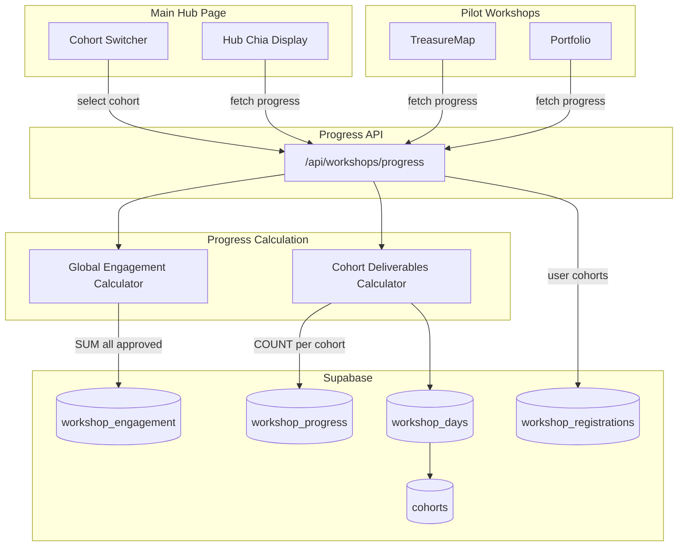
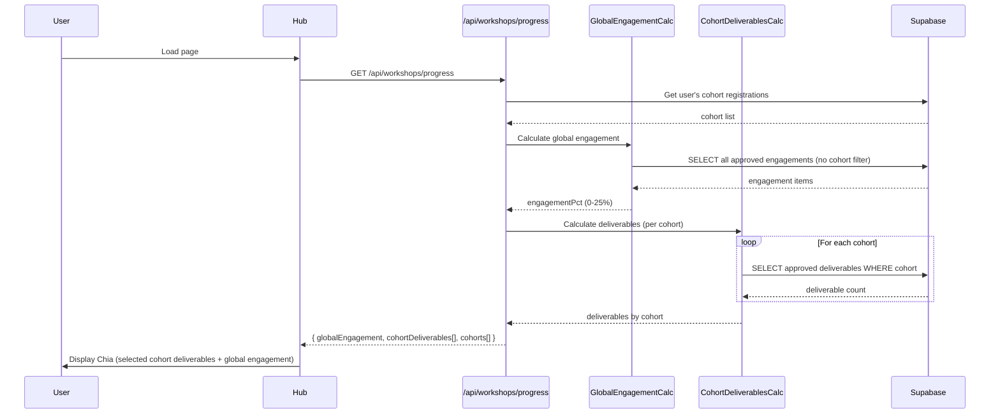

# Technical Design Document: Multi-Cohort Chia Progress System

## Overview

This design implements a multi-cohort progress system for the Chia Guardian that separates engagement (global, 25%) from deliverables (per-cohort, 75%). Users participating in multiple cohorts will see their engagement aggregated across all cohorts while deliverables are tracked independently per cohort. The Main Hub will include a cohort switcher allowing users to view their progress history across all participated cohorts.

### Key Design Decisions

1. **Option A for Engagement (per user request)**: Keep `cohort_id` on engagement records for tracking/admin purposes, but calculate engagement globally across all cohorts
2. **Option B for Hub Display (per user request)**: Single Chia Guardian with a dropdown to switch between cohorts

### Component Interaction Diagram



## Architecture

### High-Level Data Flow



### Calculation Logic

#### Global Engagement Calculator

```typescript
// Aggregates ALL approved engagement items across ALL cohorts
function calculateGlobalEngagement(profileId: string): number {
  const POINT_VALUES = { bookmark: 1, note: 1, generation: 2, prompt: 3 }
  
  // Query: SELECT * FROM workshop_engagement 
  //        WHERE profile_id = ? AND status = 'approved'
  // NOTE: No cohort_id filter - we aggregate globally
  
  const totalPoints = engagements.reduce((sum, e) => 
    sum + (POINT_VALUES[e.kind] || 0), 0)
  
  return Math.min(totalPoints, 25) // Cap at 25%
}
```

#### Cohort Deliverables Calculator

```typescript
// Calculates deliverables for a SPECIFIC cohort only
function calculateCohortDeliverables(profileId: string, cohortId: string): number {
  // Query: SELECT wp.* FROM workshop_progress wp
  //        JOIN workshop_days wd ON wp.workshop_day_id = wd.id
  //        WHERE wp.profile_id = ? 
  //        AND wd.cohort_id = ?
  //        AND wp.deliverable_status = 'approved'
  
  const approvedCount = Math.min(progressRows.length, 3)
  return approvedCount * 25 // 25% per deliverable, max 75%
}
```

## Components and Interfaces

### 1. Progress API Enhancement

**File:** `src/app/api/workshops/progress/route.ts`

#### Updated Response Interface

```typescript
interface ProgressAPIResponse {
  // Global engagement (same across all views)
  globalEngagement: {
    percentage: number        // 0-25
    approvedCount: number     // Number of approved engagement items
    pendingCount: number      // Number of pending items
    items: WorkshopEngagement[] // All engagement items (for Portfolio display)
  }
  
  // Per-cohort deliverables
  cohortProgress: {
    cohortId: string
    cohortName: string
    startDate: string
    status: 'draft' | 'open' | 'closed' | 'completed'
    deliverables: {
      percentage: number      // 0-75
      approvedCount: number   // 0-3
      progressRows: WorkshopProgress[]
    }
  }[]
  
  // Currently selected cohort (default: most recent active)
  selectedCohortId: string
  
  // Combined total for selected cohort
  totalProgress: number       // deliverables + engagement (0-100)
}
```

#### Request Parameters

```typescript
// GET /api/workshops/progress?cohort_id=<uuid>
interface ProgressAPIRequest {
  cohort_id?: string  // Optional: specific cohort to load, defaults to most recent
}
```

### 2. Hub Page Updates

**File:** `src/app/hub/page.tsx`

#### Changes Required

1. Fetch enhanced progress data including cohort list
2. Track selected cohort in state
3. Pass cohort data to `CozyHubRoom`

```typescript
interface HubProgressState {
  globalEngagement: number
  cohortProgress: CohortProgress[]
  selectedCohortId: string
  totalProgress: number
}
```

### 3. CozyHubRoom Updates

**File:** `src/components/hub/CozyHubRoom.tsx`

#### New Props

```typescript
interface CozyHubRoomProps {
  isAdmin?: boolean
  isGuest?: boolean
  avatarUrl?: string | null
  onLogout?: () => void
  initialChiaProgress?: number
  // NEW: Multi-cohort support
  cohortProgress?: CohortProgress[]
  globalEngagement?: number
  selectedCohortId?: string
  onCohortChange?: (cohortId: string) => void
}
```

#### Cohort Switcher Component

```typescript
// Inline component within CozyHubRoom
function CohortSwitcher({ 
  cohorts, 
  selectedId, 
  onSelect 
}: {
  cohorts: CohortProgress[]
  selectedId: string
  onSelect: (id: string) => void
}) {
  // Only render if multiple cohorts
  if (cohorts.length <= 1) return null
  
  return (
    <div style={{...}}>
      <select 
        value={selectedId}
        onChange={(e) => onSelect(e.target.value)}
      >
        {cohorts.map(c => (
          <option key={c.cohortId} value={c.cohortId}>
            {c.cohortName} ({c.deliverables.percentage}%)
          </option>
        ))}
      </select>
    </div>
  )
}
```

### 4. Portfolio Component Updates

**File:** `src/components/workshops/journey/Portfolio.tsx`

#### Changes Required

The Portfolio already receives `progressRows` and `engagements` as props. The changes are:

1. **Engagement calculation**: Already correct - sums all approved engagements regardless of cohort
2. **Deliverables calculation**: Already correct - based on progressRows which are cohort-filtered

No structural changes needed to Portfolio. The parent component (`JourneyClient`) already filters data correctly.

### 5. TreasureMap Component Updates

**File:** `src/components/workshops/journey/TreasureMap.tsx`

#### Current State (Already Correct)

The TreasureMap already receives:
- `approvedDays` - for deliverable percentage
- `engagementPct` - for engagement percentage

The parent (`JourneyClient`) calculates these correctly. No changes needed to TreasureMap itself.

### 6. JourneyClient Updates

**File:** `src/app/hub/pilot-workshops/JourneyClient.tsx`

#### Changes Required

The engagement calculation in JourneyClient is already global (it sums all `engagements` passed in). The key change is ensuring the parent page passes ALL engagements across cohorts, not just the current cohort's engagements.

## Data Models

### Existing Tables (No Schema Changes)

#### workshop_engagement
```sql
-- No changes needed
-- cohort_id is kept for tracking but not used in global calculation
CREATE TABLE workshop_engagement (
  id UUID PRIMARY KEY,
  profile_id UUID REFERENCES profiles(id),
  cohort_id UUID REFERENCES cohorts(id),
  kind TEXT, -- 'bookmark', 'note', 'prompt', 'generation'
  title TEXT,
  content TEXT,
  url TEXT,
  source TEXT,
  status TEXT, -- 'pending', 'approved', 'rejected'
  created_at TIMESTAMPTZ,
  updated_at TIMESTAMPTZ
);
```

#### workshop_progress
```sql
-- No changes needed
-- Linked to cohort via workshop_day_id → workshop_days.cohort_id
CREATE TABLE workshop_progress (
  id UUID PRIMARY KEY,
  profile_id UUID REFERENCES profiles(id),
  workshop_day_id UUID REFERENCES workshop_days(id),
  deliverable_status TEXT, -- 'not_submitted', 'submitted', 'approved', 'rejected'
  review_note TEXT,
  created_at TIMESTAMPTZ,
  updated_at TIMESTAMPTZ
);
```

### Query Patterns

#### Get User's Participated Cohorts

```sql
-- Via workshop_registrations
SELECT DISTINCT c.* 
FROM cohorts c
JOIN workshop_registrations wr ON wr.cohort_id = c.id
WHERE wr.profile_id = :profile_id
  AND wr.status = 'registered'
ORDER BY c.start_date DESC;

-- Alternative: Via workshop_progress (for users who have progress but no registration)
SELECT DISTINCT c.*
FROM cohorts c
JOIN workshop_days wd ON wd.cohort_id = c.id
JOIN workshop_progress wp ON wp.workshop_day_id = wd.id
WHERE wp.profile_id = :profile_id
ORDER BY c.start_date DESC;
```

#### Get Global Engagement

```sql
SELECT * FROM workshop_engagement
WHERE profile_id = :profile_id
  AND status = 'approved';
-- Note: No cohort_id filter
```

#### Get Cohort-Specific Deliverables

```sql
SELECT wp.* 
FROM workshop_progress wp
JOIN workshop_days wd ON wp.workshop_day_id = wd.id
WHERE wp.profile_id = :profile_id
  AND wd.cohort_id = :cohort_id
  AND wp.deliverable_status = 'approved';
```

## Correctness Properties

*A property is a characteristic or behavior that should hold true across all valid executions of a system—essentially, a formal statement about what the system should do. Properties serve as the bridge between human-readable specifications and machine-verifiable correctness guarantees.*

### Property 1: Global Engagement Aggregation

*For any* user with approved engagement items distributed across any number of cohorts, the Global Engagement Calculator SHALL return a percentage equal to the sum of all approved engagement point values, regardless of which cohort each engagement was created in.

**Validates: Requirements 1.1, 1.2, 6.3**

### Property 2: Engagement Point Formula

*For any* collection of approved engagement items with kinds {bookmark, note, generation, prompt}, the total engagement points SHALL equal: (count of bookmarks × 1) + (count of notes × 1) + (count of generations × 2) + (count of prompts × 3).

**Validates: Requirements 1.3**

### Property 3: Engagement Cap

*For any* user whose raw engagement points exceed 25, the Global Engagement Calculator SHALL return exactly 25.

**Validates: Requirements 1.4**

### Property 4: Cohort-Isolated Deliverables

*For any* user with approved deliverables across multiple cohorts, the Cohort Deliverables Calculator SHALL return a percentage for cohort C that counts only deliverables where `workshop_days.cohort_id = C`.

**Validates: Requirements 2.1, 2.4**

### Property 5: Deliverable Percentage Formula

*For any* cohort with N approved deliverables where N ∈ {0, 1, 2, 3, 4, ...}, the deliverable percentage SHALL equal min(N × 25, 75).

**Validates: Requirements 2.2**

### Property 6: Combined Progress Calculation

*For any* cohort view, the total Chia progress percentage SHALL equal the cohort's deliverable percentage (0-75) plus the global engagement percentage (0-25).

**Validates: Requirements 3.1**

### Property 7: Chia Stage Selection

*For any* combined progress percentage P, the Chia growth stage SHALL be:
- Stage 0 (Bare bud) if P = 0
- Stage 1 (Sprouting) if 0 < P < 25
- Stage 2 (Filling in) if 25 ≤ P < 50
- Stage 3 (Leafy crown) if 50 ≤ P < 75
- Stage 4 (Lush mane) if 75 ≤ P < 100
- Stage 5 (Full bloom) if P = 100

**Validates: Requirements 3.3**

### Property 8: Cohort List Ordering

*For any* user's participated cohort list, the cohorts SHALL be ordered by `start_date` in descending order (most recent first).

**Validates: Requirements 4.2**

### Property 9: API Cohort Parameter Handling

*For any* Progress API request with a valid `cohort_id` parameter, the response SHALL contain deliverable progress specific to that cohort AND global engagement that includes all cohorts.

**Validates: Requirements 5.2, 5.3**

### Property 10: Backward Compatibility for Deliverable Association

*For any* existing deliverable record linked via `workshop_day_id`, the system SHALL correctly determine the cohort by joining `workshop_progress.workshop_day_id` to `workshop_days.cohort_id`.

**Validates: Requirements 6.4**

### Property 11: Approval Updates Global Calculation

*For any* engagement item that transitions from status 'pending' to 'approved', the user's global engagement percentage SHALL immediately increase by the item's point value (capped at 25 total).

**Validates: Requirements 8.3**

## Error Handling

### API Error Scenarios

| Scenario | Response | Status Code |
|----------|----------|-------------|
| Unauthenticated request | `{ error: 'Unauthorized' }` | 401 |
| Profile not found | `{ error: 'Profile not found' }` | 404 |
| Invalid cohort_id format | `{ error: 'Invalid cohort ID' }` | 400 |
| Cohort not found | Return most recent cohort instead | 200 |
| No cohort participation | `{ progressRows: [], engagements: [], cohortProgress: [] }` | 200 |
| Database error | `{ error: 'Internal server error' }` | 500 |

### Frontend Error Handling

1. **Network failure**: Show cached data if available, display retry button
2. **Empty cohort list**: Hide cohort switcher, show empty state for Chia
3. **Invalid selected cohort**: Reset to most recent cohort

## Testing Strategy

### Unit Tests

1. **Global Engagement Calculator**
   - Test point value formula for each engagement kind
   - Test cap at 25%
   - Test with empty engagements
   - Test with mixed approved/pending statuses

2. **Cohort Deliverables Calculator**
   - Test percentage formula (0, 1, 2, 3 deliverables)
   - Test cap at 75%
   - Test cohort isolation (no cross-cohort contamination)

3. **Combined Progress**
   - Test addition of deliverables + engagement
   - Test stage selection thresholds

### Property-Based Tests

Property-based testing is appropriate for this feature because:
- Pure calculation functions with clear input/output behavior
- Universal properties that should hold across wide input ranges
- Testable invariants (caps, formulas, ordering)

**Configuration:**
- Library: fast-check (already used in project) or similar
- Minimum 100 iterations per property
- Tag format: `Feature: multi-cohort-chia-progress, Property N: description`

Tests will be created for Properties 1-11 listed above.

### Integration Tests

1. **API Response Structure**
   - Verify response includes all required fields
   - Verify cohort list is properly ordered
   - Verify global engagement is same regardless of cohort_id param

2. **Hub → API → Database Flow**
   - Create user with multiple cohorts
   - Add engagement items across cohorts
   - Verify Hub displays correct combined progress

3. **Cohort Switcher Behavior**
   - Verify switcher hidden for single cohort
   - Verify switcher updates Chia display on selection

### Edge Cases

1. User with no cohort registrations
2. User with registrations but no progress
3. User with engagement in deleted cohort
4. Concurrent approval of engagement item
5. Switching cohorts rapidly
