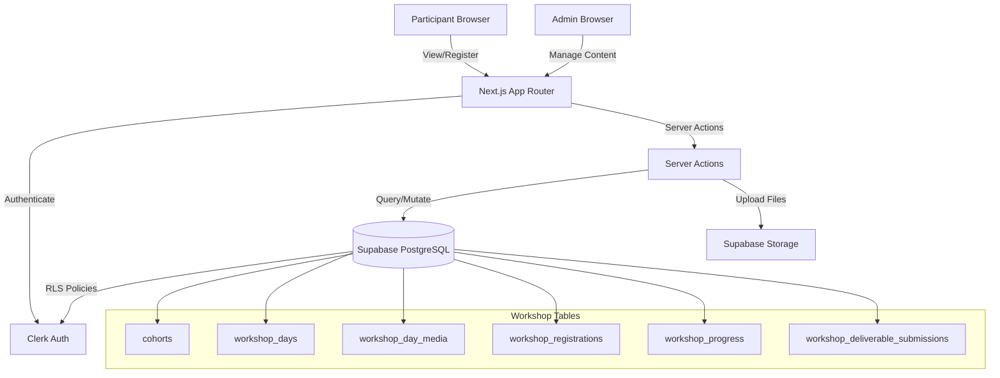
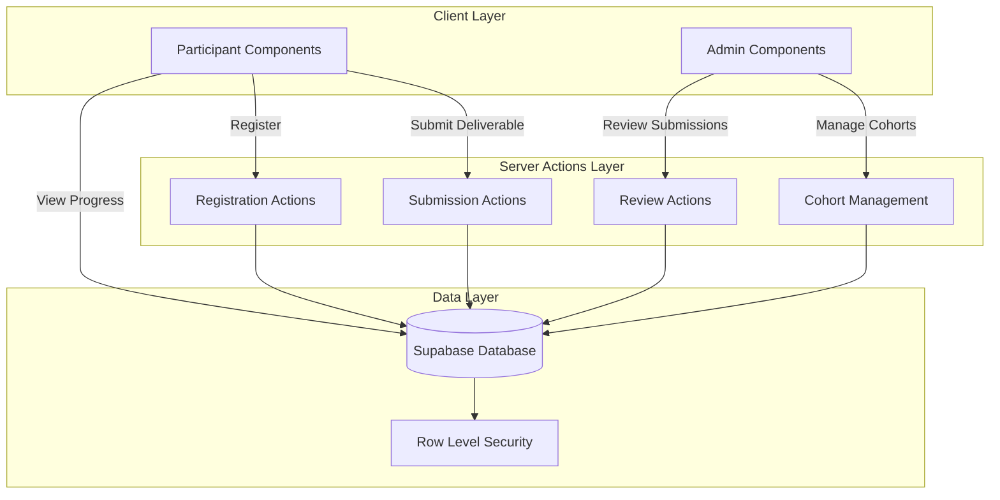

# Design Document: Pilot Workshops

## Overview

The Pilot Workshops feature implements a structured 3-day workshop system delivered through cohorts. The system enforces a two-gate access model: participants must first register for a cohort (registration gate), then progress through workshop days sequentially by submitting deliverables (progress gate). The architecture separates concerns across database schema, server actions, UI components, and access control layers.

### Core Concepts

**Two-Gate Access Model:**
1. **Registration Gate**: Users must register for a specific cohort before accessing any workshop content
2. **Progress Gate**: Once registered, users unlock days sequentially by completing deliverables

**Key Entities:**
- **Cohorts**: Scheduled instances of the 3-day workshop with start dates and capacity limits
- **Workshop Days**: Individual day content (1, 2, or 3) containing lessons and deliverable requirements
- **Registrations**: Enrollment records linking participants to cohorts
- **Progress Tracking**: Per-user, per-day records tracking unlock status and completion
- **Deliverable Submissions**: Participant work submitted for review

### Design Principles

1. **Lazy State Initialization**: Progress rows are created on first access, not pre-populated
2. **Read-Time Computation**: Day 1 unlock status is computed during dashboard load based on cohort start_date
3. **Immutable History**: Submissions are never overwritten; resubmissions create new records
4. **Fail-Safe Defaults**: Missing progress rows are treated as locked state without errors
5. **Separation of Concerns**: Registration logic is independent from day-unlock logic

## Overview

The Pilot Workshops feature implements a cohort-based, sequential learning system where participants register for scheduled 3-day workshop series, progress through content by completing deliverables, and unlock subsequent days upon completion. The system enforces a two-gate access model: registration gate (must register for cohort) and progress gate (must complete Day N to unlock Day N+1).

### Key Design Principles

- **Two-Gate Access Model**: Separate registration from day-by-day progress tracking
- **Time-Based Day 1 Unlock**: Day 1 becomes accessible when cohort start_date passes
- **Deliverable-Based Progression**: Days 2 and 3 unlock based on deliverable submission/approval
- **Read-Time Computation**: Progress state computed dynamically rather than via scheduled jobs
- **Comprehensive Audit Trail**: Track all creation, modification, and review actions
- **RLS-Enforced Security**: Row-level security policies enforce access control at database layer

### Technology Stack

- **Frontend**: Next.js 14 (App Router), React 18, TypeScript, TailwindCSS
- **Authentication**: Clerk (provides user identity, integrates with Supabase profiles)
- **Database**: Supabase (PostgreSQL with Row Level Security)
- **Storage**: Supabase Storage (for uploaded deliverable files, workshop media)
- **Rich Text**: TipTap (for workshop content and deliverable instructions)
- **UI Components**: Lucide React icons, custom Tailwind components

### Integration Points

1. **Clerk → Supabase Profiles**: `clerk_user_id` links Clerk identity to profiles table
2. **Profiles → Workshop Tables**: `profile_id` (UUID) references profiles for all user-scoped data
3. **Supabase Storage**: File uploads stored with paths referencing storage buckets
4. **RLS Policies**: Leverage `auth.uid()` (set via middleware) for access control


## Architecture

### System Architecture Diagram



### Data Flow Architecture

**Registration Flow**:
```
Participant clicks "Register"
  → Server Action: registerForCohort(cohortId)
    → Verify cohort.status = 'open'
    → Check capacity vs registered count
    → Insert workshop_registrations (status: 'registered' or 'waitlisted')
    → Return success/waitlist confirmation
  → UI updates to show "You're registered" or "Waitlisted"
```


**Day 1 Unlock Flow**:
```
Participant loads Workshop Dashboard
  → Server Action: getWorkshopDashboard(cohortId)
    → Query registration (must exist with status='registered')
    → Query cohort start_date
    → If now() >= start_date AND no progress row exists:
      → Insert workshop_progress for Day 1 (unlocked_at = now())
    → Return days with unlock states
  → UI renders Day 1 as accessible, Days 2-3 as locked
```

**Deliverable Submission Flow**:
```
Participant submits deliverable
  → Server Action: submitDeliverable(dayId, submissionData)
    → Insert workshop_deliverable_submissions
    → Update workshop_progress:
      - deliverable_submitted_at = now()
      - deliverable_status = 'submitted'
    → Return submission confirmation
  → UI shows "Submitted, awaiting review" status
```

**Admin Review Flow**:
```
Admin approves deliverable
  → Server Action: reviewDeliverable(progressId, 'approved', reviewNote?)
    → Update workshop_progress:
      - deliverable_status = 'approved'
      - reviewed_by = admin profile_id
      - reviewed_at = now()
    → Trigger next day unlock check
  → Participant's next day becomes accessible
```


## Components and Interfaces

### Component Hierarchy

```
/app/hub/pilot-workshops/
  ├── page.tsx                          # Public cohort listing
  ├── [cohortId]/
  │   ├── page.tsx                      # Workshop dashboard (participant view)
  │   └── day/[dayNumber]/
  │       └── page.tsx                  # Individual day content page
  └── admin/
      ├── page.tsx                      # Admin cohort management list
      ├── create/page.tsx               # Create new cohort
      ├── [cohortId]/
      │   ├── edit/page.tsx             # Edit cohort details
      │   ├── registrations/page.tsx    # Manage registrations
      │   ├── reviews/page.tsx          # Review deliverables
      │   └── days/
      │       ├── create/page.tsx       # Create workshop day
      │       └── [dayId]/edit/page.tsx # Edit workshop day

/components/workshops/
  ├── CohortCard.tsx                    # Display cohort summary with registration CTA
  ├── WorkshopDayStepper.tsx            # Visual progress stepper (Day 1, 2, 3)
  ├── DayContent.tsx                    # Render day's content_body and media
  ├── DeliverableSubmissionForm.tsx     # Form to submit deliverable
  ├── DeliverableStatusBadge.tsx        # Visual status indicator
  ├── RegistrationButton.tsx            # Register/Waitlist/Registered button
  └── admin/
      ├── CohortForm.tsx                # Create/edit cohort form
      ├── WorkshopDayForm.tsx           # Create/edit day content form
      ├── MediaUploader.tsx             # Upload and manage day media
      ├── RegistrantList.tsx            # List with waitlist→registered action
      └── DeliverableReviewCard.tsx     # Review interface with approve/reject
```


### Key Component Specifications

#### CohortCard.tsx

**Purpose**: Display cohort information on public listing page

**Props**:
```typescript
interface CohortCardProps {
  cohort: {
    id: string;
    name: string;
    start_date: string;
    description: string | null;
    capacity: number | null;
    status: 'draft' | 'open' | 'closed' | 'completed';
    registration_opens_at: string | null;
    registration_closes_at: string | null;
    registered_count: number;
  };
  userRegistration?: {
    status: 'registered' | 'waitlisted' | 'cancelled';
  } | null;
}
```

**Rendering Logic**:
- Show name, start_date, description
- If `capacity` is set: show "X spots remaining"
- If `userRegistration` exists: show "You're registered" or "Waitlisted"
- Else if registration open: show `<RegistrationButton />`
- Else if registration not open yet: show "Registration opens [date]"
- Else if registration closed: show "Registration closed"


#### WorkshopDayStepper.tsx

**Purpose**: Visual stepper showing Days 1, 2, 3 with progress states

**Props**:
```typescript
interface DayProgress {
  day_number: number;
  title: string;
  unlocked: boolean;
  deliverable_status: 'not_submitted' | 'submitted' | 'approved' | 'rejected' | null;
  unlock_message?: string; // e.g., "Unlocks after Day 1 is approved"
}

interface WorkshopDayStepperProps {
  days: DayProgress[];
  cohortId: string;
}
```

**Rendering States**:
- **Unlocked + Not Started**: Full color, clickable link to day page
- **Unlocked + In Progress**: Highlighted, shows "Submit deliverable" CTA
- **Unlocked + Completed**: Checkmark icon, clickable (can review content)
- **Locked**: Greyed out, shows `unlock_message`, not clickable

**Visual Design**: Horizontal stepper with connecting lines, or vertical list with icons


#### DeliverableSubmissionForm.tsx

**Purpose**: Form for participants to submit deliverables

**Props**:
```typescript
interface DeliverableSubmissionFormProps {
  dayId: string;
  deliverableType: 'text' | 'file' | 'video' | 'pending_confirmation';
  deliverableInstructions: string;
  existingSubmission?: {
    submission_text?: string;
    file_storage_path?: string;
    external_video_url?: string;
    submitted_at: string;
  };
  onSubmit: (data: SubmissionData) => Promise<void>;
}

interface SubmissionData {
  submission_text?: string;
  file?: File;
  external_video_url?: string;
}
```

**Behavior**:
- If `deliverableType === 'pending_confirmation'`: Show notice "Deliverable format being finalized"
- If `deliverableType === 'text'`: Render textarea
- If `deliverableType === 'file'`: Render file upload input
- If `deliverableType === 'video'`: Render file upload OR external URL input
- On submit: Upload file to Supabase Storage (if file), then call server action
- Show existing submission if present (with resubmit option if rejected)


#### DeliverableReviewCard.tsx (Admin)

**Purpose**: Admin interface to review and approve/reject deliverables

**Props**:
```typescript
interface DeliverableReviewCardProps {
  submission: {
    id: string;
    day_title: string;
    participant_name: string;
    submission_text?: string;
    file_storage_path?: string;
    external_video_url?: string;
    submitted_at: string;
    deliverable_status: 'submitted' | 'approved' | 'rejected';
  };
  progressId: string;
  onReview: (status: 'approved' | 'rejected', note?: string) => Promise<void>;
}
```

**Rendering**:
- Display participant name, day title, submission timestamp
- If `submission_text`: Display inline (with max height + scroll)
- If `file_storage_path`: Display download link or preview
- If `external_video_url`: Embed video player
- Show "Approve" and "Reject" buttons
- Reject button opens modal for optional review note
- Show current status badge if already reviewed


## Data Models

### Database Schema

#### cohorts

```sql
CREATE TABLE cohorts (
  id UUID PRIMARY KEY DEFAULT gen_random_uuid(),
  name TEXT NOT NULL,
  description TEXT, -- Rich text via TipTap for cohort overview
  start_date TIMESTAMPTZ NOT NULL,
  registration_opens_at TIMESTAMPTZ,
  registration_closes_at TIMESTAMPTZ,
  capacity INTEGER,
  status TEXT CHECK (status IN ('draft', 'open', 'closed', 'completed')) DEFAULT 'draft',
  created_by UUID REFERENCES profiles(id) ON DELETE RESTRICT NOT NULL,
  created_at TIMESTAMPTZ DEFAULT NOW() NOT NULL,
  updated_by UUID REFERENCES profiles(id) ON DELETE RESTRICT NOT NULL,
  updated_at TIMESTAMPTZ DEFAULT NOW() NOT NULL
);

CREATE INDEX idx_cohorts_status ON cohorts(status);
CREATE INDEX idx_cohorts_start_date ON cohorts(start_date);
```

**Constraints**:
- `status` must be one of: 'draft', 'open', 'closed', 'completed'
- `created_by` and `updated_by` reference profiles (cannot be deleted if cohorts exist)

**Indexes**:
- `status`: Fast filtering for public listing (show only 'open')
- `start_date`: Sorting cohorts chronologically


#### workshop_days

```sql
CREATE TABLE workshop_days (
  id UUID PRIMARY KEY DEFAULT gen_random_uuid(),
  cohort_id UUID REFERENCES cohorts(id) ON DELETE CASCADE NOT NULL,
  day_number INTEGER NOT NULL CHECK (day_number IN (1, 2, 3)),
  title TEXT NOT NULL,
  content_body TEXT, -- Rich text lesson content (TipTap JSON or HTML)
  deliverable_instructions TEXT, -- Text description of deliverable requirements
  deliverable_type TEXT CHECK (deliverable_type IN ('text', 'file', 'video', 'pending_confirmation')) DEFAULT 'pending_confirmation',
  requires_admin_approval BOOLEAN DEFAULT TRUE,
  created_by UUID REFERENCES profiles(id) ON DELETE RESTRICT NOT NULL,
  created_at TIMESTAMPTZ DEFAULT NOW() NOT NULL,
  updated_by UUID REFERENCES profiles(id) ON DELETE RESTRICT NOT NULL,
  updated_at TIMESTAMPTZ DEFAULT NOW() NOT NULL,
  UNIQUE(cohort_id, day_number)
);

CREATE INDEX idx_workshop_days_cohort ON workshop_days(cohort_id);
```

**Constraints**:
- `UNIQUE(cohort_id, day_number)`: Prevents duplicate Day 1, 2, or 3 within same cohort
- `day_number` must be 1, 2, or 3
- `deliverable_type` defaults to 'pending_confirmation' (client decision pending)
- `requires_admin_approval` defaults to TRUE (safe default)

**Cascade Behavior**: Deleting a cohort deletes all its workshop_days


#### workshop_day_media

```sql
CREATE TABLE workshop_day_media (
  id UUID PRIMARY KEY DEFAULT gen_random_uuid(),
  workshop_day_id UUID REFERENCES workshop_days(id) ON DELETE CASCADE NOT NULL,
  media_type TEXT CHECK (media_type IN ('pdf', 'video_link', 'external_link', 'image')) NOT NULL,
  url TEXT NOT NULL, -- External URL for links, or public URL for uploaded files
  storage_path TEXT, -- Supabase Storage path for uploaded files
  label TEXT, -- Optional descriptive label
  sort_order INTEGER DEFAULT 0,
  created_at TIMESTAMPTZ DEFAULT NOW() NOT NULL
);

CREATE INDEX idx_workshop_day_media_day ON workshop_day_media(workshop_day_id);
CREATE INDEX idx_workshop_day_media_sort ON workshop_day_media(workshop_day_id, sort_order);
```

**Usage**:
- `media_type = 'pdf'`: Uploaded PDF, `storage_path` set
- `media_type = 'image'`: Uploaded image, `storage_path` set
- `media_type = 'video_link'`: YouTube/Vimeo embed, `url` contains embed URL
- `media_type = 'external_link'`: Generic external link, `url` contains destination

**Cascade Behavior**: Deleting a workshop_day deletes all its media


#### workshop_registrations

```sql
CREATE TABLE workshop_registrations (
  id UUID PRIMARY KEY DEFAULT gen_random_uuid(),
  cohort_id UUID REFERENCES cohorts(id) ON DELETE RESTRICT NOT NULL,
  profile_id UUID REFERENCES profiles(id) ON DELETE RESTRICT NOT NULL,
  registered_at TIMESTAMPTZ DEFAULT NOW() NOT NULL,
  status TEXT CHECK (status IN ('registered', 'waitlisted', 'cancelled')) DEFAULT 'registered',
  UNIQUE(cohort_id, profile_id)
);

CREATE INDEX idx_workshop_registrations_cohort ON workshop_registrations(cohort_id);
CREATE INDEX idx_workshop_registrations_profile ON workshop_registrations(profile_id);
CREATE INDEX idx_workshop_registrations_status ON workshop_registrations(cohort_id, status);
```

**Constraints**:
- `UNIQUE(cohort_id, profile_id)`: Prevents duplicate registrations
- Cannot delete cohort or profile if registrations exist (RESTRICT)

**Indexes**:
- `cohort_id`: Fast lookup of all registrants for a cohort
- `profile_id`: Fast lookup of all cohorts a user is registered for
- `cohort_id, status`: Fast counting of registered vs waitlisted


#### workshop_progress

```sql
CREATE TABLE workshop_progress (
  id UUID PRIMARY KEY DEFAULT gen_random_uuid(),
  workshop_day_id UUID REFERENCES workshop_days(id) ON DELETE RESTRICT NOT NULL,
  profile_id UUID REFERENCES profiles(id) ON DELETE RESTRICT NOT NULL,
  unlocked_at TIMESTAMPTZ, -- NULL until day becomes accessible
  deliverable_submitted_at TIMESTAMPTZ,
  deliverable_status TEXT CHECK (deliverable_status IN ('not_submitted', 'submitted', 'approved', 'rejected')) DEFAULT 'not_submitted',
  reviewed_by UUID REFERENCES profiles(id) ON DELETE SET NULL,
  reviewed_at TIMESTAMPTZ,
  review_note TEXT, -- Admin feedback on rejection
  UNIQUE(workshop_day_id, profile_id)
);

CREATE INDEX idx_workshop_progress_day ON workshop_progress(workshop_day_id);
CREATE INDEX idx_workshop_progress_profile ON workshop_progress(profile_id);
CREATE INDEX idx_workshop_progress_status ON workshop_progress(deliverable_status);
```

**Constraints**:
- `UNIQUE(workshop_day_id, profile_id)`: One progress row per user per day
- Cannot delete workshop_day or profile if progress rows exist (RESTRICT)
- `reviewed_by` SET NULL if reviewer is deleted (preserves review timestamp)

**Lifecycle**:
1. Row created with `unlocked_at = NOW()` when day first becomes accessible
2. `deliverable_submitted_at` set when participant submits
3. `deliverable_status` → 'submitted'
4. Admin reviews: status → 'approved' or 'rejected', `reviewed_by` and `reviewed_at` set
5. If rejected and resubmitted: status back to 'submitted', new submission created


#### workshop_deliverable_submissions

```sql
CREATE TABLE workshop_deliverable_submissions (
  id UUID PRIMARY KEY DEFAULT gen_random_uuid(),
  workshop_day_id UUID REFERENCES workshop_days(id) ON DELETE RESTRICT NOT NULL,
  profile_id UUID REFERENCES profiles(id) ON DELETE RESTRICT NOT NULL,
  submission_text TEXT,
  file_storage_path TEXT,
  external_video_url TEXT,
  submitted_at TIMESTAMPTZ DEFAULT NOW() NOT NULL
);

CREATE INDEX idx_deliverable_submissions_day ON workshop_deliverable_submissions(workshop_day_id);
CREATE INDEX idx_deliverable_submissions_profile ON workshop_deliverable_submissions(profile_id);
CREATE INDEX idx_deliverable_submissions_day_profile ON workshop_deliverable_submissions(workshop_day_id, profile_id, submitted_at DESC);
```

**Purpose**: 
- Maintains complete submission history
- Allows resubmission without overwriting previous attempts
- Separate from `workshop_progress` to support multiple submissions per day

**Fields**:
- `submission_text`: For text-based deliverables
- `file_storage_path`: Supabase Storage path for uploaded files
- `external_video_url`: YouTube/Loom links for video deliverables

**Query Pattern**: Get latest submission for a user/day:
```sql
SELECT * FROM workshop_deliverable_submissions
WHERE workshop_day_id = ? AND profile_id = ?
ORDER BY submitted_at DESC
LIMIT 1;
```


### TypeScript Type Definitions

```typescript
// Database types
export interface Cohort {
  id: string;
  name: string;
  description: string | null;
  start_date: string; // ISO 8601 timestamp
  registration_opens_at: string | null;
  registration_closes_at: string | null;
  capacity: number | null;
  status: 'draft' | 'open' | 'closed' | 'completed';
  created_by: string;
  created_at: string;
  updated_by: string;
  updated_at: string;
}

export interface WorkshopDay {
  id: string;
  cohort_id: string;
  day_number: 1 | 2 | 3;
  title: string;
  content_body: string | null;
  deliverable_instructions: string | null;
  deliverable_type: 'text' | 'file' | 'video' | 'pending_confirmation';
  requires_admin_approval: boolean;
  created_by: string;
  created_at: string;
  updated_by: string;
  updated_at: string;
}

export interface WorkshopDayMedia {
  id: string;
  workshop_day_id: string;
  media_type: 'pdf' | 'video_link' | 'external_link' | 'image';
  url: string;
  storage_path: string | null;
  label: string | null;
  sort_order: number;
  created_at: string;
}
```


```typescript
export interface WorkshopRegistration {
  id: string;
  cohort_id: string;
  profile_id: string;
  registered_at: string;
  status: 'registered' | 'waitlisted' | 'cancelled';
}

export interface WorkshopProgress {
  id: string;
  workshop_day_id: string;
  profile_id: string;
  unlocked_at: string | null;
  deliverable_submitted_at: string | null;
  deliverable_status: 'not_submitted' | 'submitted' | 'approved' | 'rejected';
  reviewed_by: string | null;
  reviewed_at: string | null;
  review_note: string | null;
}

export interface WorkshopDeliverableSubmission {
  id: string;
  workshop_day_id: string;
  profile_id: string;
  submission_text: string | null;
  file_storage_path: string | null;
  external_video_url: string | null;
  submitted_at: string;
}

// Derived/computed types for UI
export interface DayWithProgress extends WorkshopDay {
  unlocked: boolean;
  progress: WorkshopProgress | null;
  unlock_message: string | null;
  media: WorkshopDayMedia[];
}
```


## API/Server Actions

### Participant Actions

#### `getPublicCohorts()`

**Purpose**: Fetch all cohorts visible to public (status='open')

**Implementation**:
```typescript
'use server'
export async function getPublicCohorts() {
  const supabase = createServerSupabaseClient();
  const { userId } = await auth();
  
  // Get open cohorts with registration count
  const { data: cohorts, error } = await supabase
    .from('cohorts')
    .select(`
      *,
      workshop_registrations!inner(count)
    `)
    .eq('status', 'open')
    .order('start_date', { ascending: true });
  
  if (error) throw error;
  
  // If user is logged in, check their registrations
  let userRegistrations = [];
  if (userId) {
    const { data: profile } = await supabase
      .from('profiles')
      .select('id')
      .eq('clerk_user_id', userId)
      .single();
    
    if (profile) {
      const { data } = await supabase
        .from('workshop_registrations')
        .select('cohort_id, status')
        .eq('profile_id', profile.id);
      userRegistrations = data || [];
    }
  }
  
  return cohorts.map(cohort => ({
    ...cohort,
    registered_count: cohort.workshop_registrations[0]?.count || 0,
    user_registration: userRegistrations.find(r => r.cohort_id === cohort.id)
  }));
}
```


#### `registerForCohort(cohortId: string)`

**Purpose**: Register authenticated user for a cohort

**Validations**:
1. Cohort exists and status is 'open'
2. Registration window is open (check registration_opens_at and registration_closes_at)
3. User not already registered (unique constraint handles this as backup)
4. Check capacity and set status accordingly

**Implementation**:
```typescript
'use server'
export async function registerForCohort(cohortId: string) {
  const supabase = createServerSupabaseClient();
  const { userId } = await auth();
  
  if (!userId) throw new Error('Authentication required');
  
  // Get user profile
  const { data: profile } = await supabase
    .from('profiles')
    .select('id')
    .eq('clerk_user_id', userId)
    .single();
  
  if (!profile) throw new Error('Profile not found');
  
  // Get cohort and validate
  const { data: cohort } = await supabase
    .from('cohorts')
    .select('*, workshop_registrations!inner(count)')
    .eq('id', cohortId)
    .single();
  
  if (!cohort) throw new Error('Cohort not found');
  if (cohort.status !== 'open') throw new Error('Registration is not currently open');
  
  const now = new Date();
  if (cohort.registration_opens_at && new Date(cohort.registration_opens_at) > now) {
    throw new Error('Registration has not opened yet');
  }
  if (cohort.registration_closes_at && new Date(cohort.registration_closes_at) < now) {
    throw new Error('Registration has closed');
  }
```


```typescript
  // Check capacity
  const registeredCount = cohort.workshop_registrations[0]?.count || 0;
  const status = cohort.capacity && registeredCount >= cohort.capacity
    ? 'waitlisted'
    : 'registered';
  
  // Insert registration
  const { error } = await supabase
    .from('workshop_registrations')
    .insert({
      cohort_id: cohortId,
      profile_id: profile.id,
      status
    });
  
  if (error) {
    if (error.code === '23505') { // Unique violation
      throw new Error('You are already registered for this cohort');
    }
    throw error;
  }
  
  return { status, cohortName: cohort.name, startDate: cohort.start_date };
}
```

**Return Value**:
```typescript
{
  status: 'registered' | 'waitlisted',
  cohortName: string,
  startDate: string
}
```


#### `getWorkshopDashboard(cohortId: string)`

**Purpose**: Get participant's workshop dashboard with day unlock states

**Logic**:
1. Verify user is registered for cohort
2. Get all workshop days for cohort
3. Compute unlock state for each day
4. Lazily create Day 1 progress row if unlocked but missing
5. Return days with progress and media

**Implementation**:
```typescript
'use server'
export async function getWorkshopDashboard(cohortId: string): Promise<DayWithProgress[]> {
  const supabase = createServerSupabaseClient();
  const { userId } = await auth();
  
  if (!userId) throw new Error('Authentication required');
  
  const { data: profile } = await supabase
    .from('profiles')
    .select('id')
    .eq('clerk_user_id', userId)
    .single();
  
  // Check registration
  const { data: registration } = await supabase
    .from('workshop_registrations')
    .select('status')
    .eq('cohort_id', cohortId)
    .eq('profile_id', profile.id)
    .single();
  
  if (!registration) throw new Error('Not registered for this cohort');
  if (registration.status !== 'registered') {
    throw new Error('Cohort access requires registered status');
  }
```


```typescript
  // Get cohort to check start_date
  const { data: cohort } = await supabase
    .from('cohorts')
    .select('start_date')
    .eq('id', cohortId)
    .single();
  
  const cohortStarted = new Date(cohort.start_date) <= new Date();
  
  // Get days with progress and media
  const { data: days } = await supabase
    .from('workshop_days')
    .select(`
      *,
      workshop_progress(
        id, unlocked_at, deliverable_submitted_at, 
        deliverable_status, reviewed_by, reviewed_at, review_note
      ),
      workshop_day_media(*)
    `)
    .eq('cohort_id', cohortId)
    .eq('workshop_progress.profile_id', profile.id)
    .order('day_number');
  
  // Process each day to determine unlock state
  const processedDays = await Promise.all(days.map(async (day) => {
    let unlocked = false;
    let unlockMessage = null;
    let progress = day.workshop_progress?.[0] || null;
```


```typescript
    if (day.day_number === 1) {
      // Day 1 unlocks when cohort starts
      if (cohortStarted) {
        unlocked = true;
        // Lazily create progress row if missing
        if (!progress) {
          const { data: newProgress } = await supabase
            .from('workshop_progress')
            .insert({
              workshop_day_id: day.id,
              profile_id: profile.id,
              unlocked_at: new Date().toISOString()
            })
            .select()
            .single();
          progress = newProgress;
        }
      } else {
        unlockMessage = `Starts on ${new Date(cohort.start_date).toLocaleDateString()}`;
      }
    } else {
      // Days 2+ unlock based on previous day completion
      unlocked = await isDayUnlockedForUser(day.id, profile.id);
      if (!unlocked) {
        unlockMessage = `Unlocks after Day ${day.day_number - 1} is ${
          day.requires_admin_approval ? 'approved' : 'submitted'
        }`;
      }
    }
    
    return {
      ...day,
      unlocked,
      progress,
      unlock_message: unlockMessage,
      media: day.workshop_day_media || []
    };
  }));
  
  return processedDays;
}
```


#### `submitDeliverable(dayId: string, submissionData: SubmissionData)`

**Purpose**: Submit deliverable for a workshop day

**Validations**:
1. Day is unlocked for user
2. SubmissionData matches deliverable_type
3. File upload to Supabase Storage if file provided

**Implementation**:
```typescript
'use server'
interface SubmissionData {
  submission_text?: string;
  file?: File;
  external_video_url?: string;
}

export async function submitDeliverable(dayId: string, data: SubmissionData) {
  const supabase = createServerSupabaseClient();
  const { userId } = await auth();
  
  const { data: profile } = await supabase
    .from('profiles')
    .select('id')
    .eq('clerk_user_id', userId)
    .single();
  
  // Verify day is unlocked
  const { data: progress } = await supabase
    .from('workshop_progress')
    .select('unlocked_at')
    .eq('workshop_day_id', dayId)
    .eq('profile_id', profile.id)
    .single();
  
  if (!progress || !progress.unlocked_at) {
    throw new Error('This day is not yet unlocked');
  }
```


```typescript
  // Handle file upload if present
  let file_storage_path = null;
  if (data.file) {
    const fileName = `${profile.id}/${dayId}/${Date.now()}_${data.file.name}`;
    const { error: uploadError } = await supabase.storage
      .from('workshop-deliverables')
      .upload(fileName, data.file);
    
    if (uploadError) throw uploadError;
    file_storage_path = fileName;
  }
  
  // Insert submission
  const { error: submissionError } = await supabase
    .from('workshop_deliverable_submissions')
    .insert({
      workshop_day_id: dayId,
      profile_id: profile.id,
      submission_text: data.submission_text,
      file_storage_path,
      external_video_url: data.external_video_url
    });
  
  if (submissionError) throw submissionError;
  
  // Update progress status
  const { error: progressError } = await supabase
    .from('workshop_progress')
    .update({
      deliverable_submitted_at: new Date().toISOString(),
      deliverable_status: 'submitted'
    })
    .eq('workshop_day_id', dayId)
    .eq('profile_id', profile.id);
  
  if (progressError) throw progressError;
  
  return { success: true };
}
```


### Admin Actions

#### `createCohort(cohortData: CreateCohortInput)`

**Purpose**: Create new workshop cohort

**Implementation**:
```typescript
'use server'
interface CreateCohortInput {
  name: string;
  description?: string;
  start_date: string;
  registration_opens_at?: string;
  registration_closes_at?: string;
  capacity?: number;
  status: 'draft' | 'open';
}

export async function createCohort(data: CreateCohortInput) {
  const supabase = createServerSupabaseClient();
  const { userId } = await auth();
  
  const { data: profile } = await supabase
    .from('profiles')
    .select('id, role')
    .eq('clerk_user_id', userId)
    .single();
  
  if (!['admin', 'super_admin'].includes(profile.role)) {
    throw new Error('Admin access required');
  }
  
  const { data: cohort, error } = await supabase
    .from('cohorts')
    .insert({
      ...data,
      created_by: profile.id,
      updated_by: profile.id
    })
    .select()
    .single();
  
  if (error) throw error;
  return cohort;
}
```


#### `createWorkshopDay(dayData: CreateWorkshopDayInput)`

**Purpose**: Create workshop day content

**Implementation**:
```typescript
'use server'
interface CreateWorkshopDayInput {
  cohort_id: string;
  day_number: 1 | 2 | 3;
  title: string;
  content_body: string;
  deliverable_instructions: string;
  deliverable_type?: 'text' | 'file' | 'video' | 'pending_confirmation';
  requires_admin_approval?: boolean;
}

export async function createWorkshopDay(data: CreateWorkshopDayInput) {
  const supabase = createServerSupabaseClient();
  const { userId } = await auth();
  
  const { data: profile } = await supabase
    .from('profiles')
    .select('id, role')
    .eq('clerk_user_id', userId)
    .single();
  
  if (!['admin', 'super_admin'].includes(profile.role)) {
    throw new Error('Admin access required');
  }
  
  const { data: day, error } = await supabase
    .from('workshop_days')
    .insert({
      ...data,
      created_by: profile.id,
      updated_by: profile.id
    })
    .select()
    .single();
  
  if (error) throw error;
  return day;
}
```


#### `getCohorRegistrants(cohortId: string)`

**Purpose**: Get all registrants for a cohort (admin view)

**Implementation**:
```typescript
'use server'
export async function getCohortRegistrants(cohortId: string) {
  const supabase = createServerSupabaseClient();
  const { userId } = await auth();
  
  const { data: profile } = await supabase
    .from('profiles')
    .select('role')
    .eq('clerk_user_id', userId)
    .single();
  
  if (!['admin', 'super_admin'].includes(profile.role)) {
    throw new Error('Admin access required');
  }
  
  const { data, error } = await supabase
    .from('workshop_registrations')
    .select(`
      *,
      profiles!inner(
        id, full_name, email
      )
    `)
    .eq('cohort_id', cohortId)
    .order('registered_at');
  
  if (error) throw error;
  return data;
}
```


#### `updateRegistrationStatus(registrationId: string, status: 'registered' | 'waitlisted')`

**Purpose**: Move participant from waitlist to registered (or vice versa)

**Implementation**:
```typescript
'use server'
export async function updateRegistrationStatus(
  registrationId: string, 
  status: 'registered' | 'waitlisted'
) {
  const supabase = createServerSupabaseClient();
  const { userId } = await auth();
  
  const { data: profile } = await supabase
    .from('profiles')
    .select('role')
    .eq('clerk_user_id', userId)
    .single();
  
  if (!['admin', 'super_admin'].includes(profile.role)) {
    throw new Error('Admin access required');
  }
  
  const { error } = await supabase
    .from('workshop_registrations')
    .update({ status })
    .eq('id', registrationId);
  
  if (error) throw error;
  return { success: true };
}
```


#### `getPendingDeliverables(cohortId?: string)`

**Purpose**: Get all submitted deliverables awaiting review

**Implementation**:
```typescript
'use server'
export async function getPendingDeliverables(cohortId?: string) {
  const supabase = createServerSupabaseClient();
  const { userId } = await auth();
  
  const { data: profile } = await supabase
    .from('profiles')
    .select('role')
    .eq('clerk_user_id', userId)
    .single();
  
  if (!['admin', 'super_admin'].includes(profile.role)) {
    throw new Error('Admin access required');
  }
  
  let query = supabase
    .from('workshop_progress')
    .select(`
      id,
      deliverable_submitted_at,
      deliverable_status,
      workshop_days!inner(
        id, title, day_number, cohort_id,
        cohorts!inner(name)
      ),
      profiles!inner(
        id, full_name, email
      ),
      workshop_deliverable_submissions!inner(
        submission_text, file_storage_path, external_video_url, submitted_at
      )
    `)
    .eq('deliverable_status', 'submitted')
    .order('deliverable_submitted_at', { ascending: true });
  
  if (cohortId) {
    query = query.eq('workshop_days.cohort_id', cohortId);
  }
  
  const { data, error } = await query;
  if (error) throw error;
  return data;
}
```


#### `reviewDeliverable(progressId: string, status: 'approved' | 'rejected', reviewNote?: string)`

**Purpose**: Approve or reject a submitted deliverable

**Implementation**:
```typescript
'use server'
export async function reviewDeliverable(
  progressId: string,
  status: 'approved' | 'rejected',
  reviewNote?: string
) {
  const supabase = createServerSupabaseClient();
  const { userId } = await auth();
  
  const { data: profile } = await supabase
    .from('profiles')
    .select('id, role')
    .eq('clerk_user_id', userId)
    .single();
  
  if (!['admin', 'super_admin'].includes(profile.role)) {
    throw new Error('Admin access required');
  }
  
  const { error } = await supabase
    .from('workshop_progress')
    .update({
      deliverable_status: status,
      reviewed_by: profile.id,
      reviewed_at: new Date().toISOString(),
      review_note: reviewNote || null
    })
    .eq('id', progressId);
  
  if (error) throw error;
  
  // TODO: Trigger next day unlock if approved
  // This will call isDayUnlockedForUser for the next day
  
  return { success: true };
}
```


## State Management

### Unlock State Flow

The system uses **read-time computation** rather than scheduled jobs to determine unlock states. This approach is more resilient and simpler to implement.

#### State Transitions

**Registration State**:
```
Not Registered → Register → Registered
                         → Waitlisted (if at capacity)
Waitlisted → Admin Action → Registered
```

**Day 1 Progress State**:
```
Locked (before start_date) → Time Passes → Unlocked
  → User first access → Progress row created (unlocked_at set)
  → Deliverable submission → deliverable_status: 'submitted'
  → Admin review → deliverable_status: 'approved' | 'rejected'
```

**Day 2/3 Progress State**:
```
Locked (awaiting previous day) 
  → Previous day approved → Unlocked
  → Progress row created (unlocked_at set)
  → (same submission/review flow as Day 1)
```


### Client-Side State Management

**Approach**: Server Actions with optimistic UI updates

**No global state library needed** — each page fetches its data via server actions and uses React's built-in state (useState, useOptimistic) for UI updates.

#### Example: Registration Flow

```typescript
// In CohortCard component
const [isRegistering, setIsRegistering] = useState(false);

async function handleRegister() {
  setIsRegistering(true);
  try {
    const result = await registerForCohort(cohort.id);
    toast.success(`Successfully ${result.status === 'waitlisted' ? 'waitlisted' : 'registered'} for ${result.cohortName}`);
    router.refresh(); // Refresh server data
  } catch (error) {
    toast.error(error.message);
  } finally {
    setIsRegistering(false);
  }
}
```

#### Example: Deliverable Submission

```typescript
// In DeliverableSubmissionForm component
const [isSubmitting, setIsSubmitting] = useState(false);

async function handleSubmit(data: SubmissionData) {
  setIsSubmitting(true);
  try {
    await submitDeliverable(dayId, data);
    toast.success('Deliverable submitted successfully');
    router.refresh();
  } catch (error) {
    toast.error(error.message);
  } finally {
    setIsSubmitting(false);
  }
}
```


## Unlock Algorithms

### Day 1 Unlock Algorithm

**Trigger**: Time-based (cohort start_date)

**Algorithm**:
```typescript
function isDay1Unlocked(cohortStartDate: string): boolean {
  return new Date(cohortStartDate) <= new Date();
}
```

**Implementation in getWorkshopDashboard**:
1. Query cohort to get start_date
2. If `now() >= start_date`: Day 1 is unlocked
3. On first access after unlock, lazily create `workshop_progress` row with `unlocked_at = now()`
4. If start_date is in future: Display "Starts on [date]" message

**Why lazy creation?**
- Avoids need for scheduled jobs
- More resilient (no missed cron runs)
- Progress row creation happens exactly when user accesses dashboard


### Day 2/3 Unlock Algorithm (Stub Implementation)

**Trigger**: Deliverable-based (previous day completion)

**Function Signature**:
```typescript
async function isDayUnlockedForUser(dayId: string, profileId: string): Promise<boolean>
```

**Implementation** (with stub for client confirmation):
```typescript
'use server'
async function isDayUnlockedForUser(dayId: string, profileId: string): Promise<boolean> {
  const supabase = createServerSupabaseClient();
  
  // Get current day to find previous day
  const { data: currentDay } = await supabase
    .from('workshop_days')
    .select('day_number, cohort_id, requires_admin_approval')
    .eq('id', dayId)
    .single();
  
  if (!currentDay || currentDay.day_number === 1) {
    // Day 1 uses time-based unlock, not this function
    return false;
  }
  
  // Find previous day
  const { data: previousDay } = await supabase
    .from('workshop_days')
    .select('id, requires_admin_approval')
    .eq('cohort_id', currentDay.cohort_id)
    .eq('day_number', currentDay.day_number - 1)
    .single();
  
  if (!previousDay) return false;
```


```typescript
  // Get previous day's progress
  const { data: previousProgress } = await supabase
    .from('workshop_progress')
    .select('deliverable_status')
    .eq('workshop_day_id', previousDay.id)
    .eq('profile_id', profileId)
    .single();
  
  if (!previousProgress) return false;
  
  // TODO: Client to confirm which branch is correct
  // Branch A: Auto-unlock on submission (requires_admin_approval = false)
  // Branch B: Require admin approval (requires_admin_approval = true)
  
  if (previousDay.requires_admin_approval) {
    // Wait for admin approval
    return previousProgress.deliverable_status === 'approved';
  } else {
    // Auto-unlock on submission
    return ['submitted', 'approved'].includes(previousProgress.deliverable_status);
  }
}
```

**Stub Status**: 
- Logic implemented for both branches
- `requires_admin_approval` defaults to TRUE (safe default)
- TODO comment indicates client confirmation needed
- No schema change required to switch between behaviors


### Lazy Progress Row Creation

**Pattern**: Create progress rows on-demand rather than pre-populating

**When to create**:
1. **Day 1**: When user first accesses dashboard after start_date
2. **Day 2/3**: When unlock condition is met and user loads dashboard

**Implementation**:
```typescript
// In getWorkshopDashboard, for each unlocked day
if (unlocked && !progress) {
  const { data: newProgress } = await supabase
    .from('workshop_progress')
    .insert({
      workshop_day_id: day.id,
      profile_id: profile.id,
      unlocked_at: new Date().toISOString()
    })
    .select()
    .single();
  progress = newProgress;
}
```

**Benefits**:
- No scheduled jobs needed
- No race conditions from concurrent cron runs
- Natural error recovery (missing row = locked state until user next loads page)
- Simpler infrastructure


## File Structure

### Directory Organization

```
src/
├── app/
│   ├── hub/
│   │   └── pilot-workshops/
│   │       ├── page.tsx                          # Public cohort listing
│   │       ├── [cohortId]/
│   │       │   ├── page.tsx                      # Workshop dashboard
│   │       │   └── day/
│   │       │       └── [dayNumber]/
│   │       │           └── page.tsx              # Day content page
│   │       └── admin/
│   │           ├── page.tsx                      # Admin cohort list
│   │           ├── create/
│   │           │   └── page.tsx                  # Create cohort form
│   │           ├── [cohortId]/
│   │           │   ├── edit/
│   │           │   │   └── page.tsx              # Edit cohort
│   │           │   ├── registrations/
│   │           │   │   └── page.tsx              # Manage registrants
│   │           │   ├── reviews/
│   │           │   │   └── page.tsx              # Review deliverables
│   │           │   └── days/
│   │           │       ├── create/
│   │           │       │   └── page.tsx          # Create workshop day
│   │           │       └── [dayId]/
│   │           │           └── edit/
│   │           │               └── page.tsx      # Edit workshop day
│   └── api/
│       └── workshops/
│           └── upload/
│               └── route.ts                      # File upload endpoint
```


```
src/
├── components/
│   └── workshops/
│       ├── CohortCard.tsx                        # Cohort summary card
│       ├── RegistrationButton.tsx                # Register/Waitlist button
│       ├── WorkshopDayStepper.tsx                # Day progress stepper
│       ├── DayContent.tsx                        # Day content renderer
│       ├── DeliverableSubmissionForm.tsx         # Submission form
│       ├── DeliverableStatusBadge.tsx            # Status indicator
│       └── admin/
│           ├── CohortForm.tsx                    # Create/edit cohort
│           ├── WorkshopDayForm.tsx               # Create/edit day
│           ├── MediaUploader.tsx                 # Media management
│           ├── RegistrantList.tsx                # Registrant management
│           └── DeliverableReviewCard.tsx         # Review interface
├── lib/
│   └── workshops/
│       ├── actions.ts                            # Server actions
│       ├── queries.ts                            # Database queries
│       ├── unlock.ts                             # Unlock algorithms
│       └── types.ts                              # TypeScript types
└── utils/
    └── supabase/
        └── server.ts                             # Supabase client
```

### migrations/
```
migrations/
└── 004_workshops.sql                             # Workshop tables schema
```


### File Naming Conventions

- **Pages**: `page.tsx` (Next.js App Router convention)
- **Components**: PascalCase (e.g., `CohortCard.tsx`)
- **Server Actions**: Grouped in `actions.ts` files, camelCase function names
- **Types**: `types.ts` with PascalCase interfaces
- **Utilities**: camelCase file names, camelCase function names

### Code Organization Patterns

**Server Actions Location**:
- Participant actions: `lib/workshops/actions.ts`
- Admin actions: `lib/workshops/admin-actions.ts`
- Shared utilities: `lib/workshops/queries.ts`, `lib/workshops/unlock.ts`

**Component Organization**:
- Public-facing components: `components/workshops/`
- Admin components: `components/workshops/admin/`
- Shared UI primitives: `components/ui/` (buttons, badges, forms)

**Type Definitions**:
- Database types: `lib/workshops/types.ts`
- API types: Inline with server actions
- Component prop types: Inline with component definitions


## RLS Policies

### cohorts

**Public Read (Open Cohorts)**:
```sql
CREATE POLICY "Public can view open cohorts"
ON cohorts FOR SELECT
TO public
USING (status = 'open');
```

**Admin Read All**:
```sql
CREATE POLICY "Admins can view all cohorts"
ON cohorts FOR SELECT
TO authenticated
USING (
  EXISTS (
    SELECT 1 FROM profiles
    WHERE profiles.clerk_user_id = auth.uid()
    AND profiles.role IN ('admin', 'super_admin')
  )
);
```

**Admin Write**:
```sql
CREATE POLICY "Admins can insert cohorts"
ON cohorts FOR INSERT
TO authenticated
WITH CHECK (
  EXISTS (
    SELECT 1 FROM profiles
    WHERE profiles.clerk_user_id = auth.uid()
    AND profiles.role IN ('admin', 'super_admin')
  )
);

CREATE POLICY "Admins can update cohorts"
ON cohorts FOR UPDATE
TO authenticated
USING (
  EXISTS (
    SELECT 1 FROM profiles
    WHERE profiles.clerk_user_id = auth.uid()
    AND profiles.role IN ('admin', 'super_admin')
  )
);
```


### workshop_days

**Registered Participants Can Read Their Cohort's Days**:
```sql
CREATE POLICY "Registered participants can view workshop days"
ON workshop_days FOR SELECT
TO authenticated
USING (
  EXISTS (
    SELECT 1 FROM workshop_registrations wr
    JOIN profiles p ON p.id = wr.profile_id
    WHERE wr.cohort_id = workshop_days.cohort_id
    AND p.clerk_user_id = auth.uid()
    AND wr.status = 'registered'
  )
);
```

**Admin Read All**:
```sql
CREATE POLICY "Admins can view all workshop days"
ON workshop_days FOR SELECT
TO authenticated
USING (
  EXISTS (
    SELECT 1 FROM profiles
    WHERE profiles.clerk_user_id = auth.uid()
    AND profiles.role IN ('admin', 'super_admin')
  )
);
```

**Admin Write**:
```sql
CREATE POLICY "Admins can manage workshop days"
ON workshop_days FOR ALL
TO authenticated
USING (
  EXISTS (
    SELECT 1 FROM profiles
    WHERE profiles.clerk_user_id = auth.uid()
    AND profiles.role IN ('admin', 'super_admin')
  )
);
```


### workshop_day_media

**Same as workshop_days** (inherits access through workshop_day_id):
```sql
CREATE POLICY "Users can view media for accessible days"
ON workshop_day_media FOR SELECT
TO authenticated
USING (
  EXISTS (
    SELECT 1 FROM workshop_days wd
    JOIN workshop_registrations wr ON wr.cohort_id = wd.cohort_id
    JOIN profiles p ON p.id = wr.profile_id
    WHERE wd.id = workshop_day_media.workshop_day_id
    AND p.clerk_user_id = auth.uid()
    AND wr.status = 'registered'
  )
  OR EXISTS (
    SELECT 1 FROM profiles
    WHERE profiles.clerk_user_id = auth.uid()
    AND profiles.role IN ('admin', 'super_admin')
  )
);

CREATE POLICY "Admins can manage media"
ON workshop_day_media FOR ALL
TO authenticated
USING (
  EXISTS (
    SELECT 1 FROM profiles
    WHERE profiles.clerk_user_id = auth.uid()
    AND profiles.role IN ('admin', 'super_admin')
  )
);
```


### workshop_registrations

**Users Can Read Their Own Registrations**:
```sql
CREATE POLICY "Users can view own registrations"
ON workshop_registrations FOR SELECT
TO authenticated
USING (
  EXISTS (
    SELECT 1 FROM profiles
    WHERE profiles.id = workshop_registrations.profile_id
    AND profiles.clerk_user_id = auth.uid()
  )
);
```

**Users Can Register Themselves**:
```sql
CREATE POLICY "Users can register for cohorts"
ON workshop_registrations FOR INSERT
TO authenticated
WITH CHECK (
  EXISTS (
    SELECT 1 FROM profiles
    WHERE profiles.id = workshop_registrations.profile_id
    AND profiles.clerk_user_id = auth.uid()
  )
);
```

**Admin Read All**:
```sql
CREATE POLICY "Admins can view all registrations"
ON workshop_registrations FOR SELECT
TO authenticated
USING (
  EXISTS (
    SELECT 1 FROM profiles
    WHERE profiles.clerk_user_id = auth.uid()
    AND profiles.role IN ('admin', 'super_admin')
  )
);
```

**Admin Update (for status changes)**:
```sql
CREATE POLICY "Admins can update registrations"
ON workshop_registrations FOR UPDATE
TO authenticated
USING (
  EXISTS (
    SELECT 1 FROM profiles
    WHERE profiles.clerk_user_id = auth.uid()
    AND profiles.role IN ('admin', 'super_admin')
  )
);
```


## Architecture

### System Architecture Diagram



### Technology Stack

- **Frontend**: Next.js 14 (App Router), React Server Components
- **Backend**: Next.js Server Actions
- **Database**: Supabase (PostgreSQL)
- **Authentication**: Clerk
- **Access Control**: Supabase Row Level Security (RLS)
- **Rich Text**: Tiptap (for workshop content)
- **File Storage**: Supabase Storage

### Architectural Patterns

**Server-Side Data Loading**: Use React Server Components for initial data loading, eliminating client-side API calls for reads

**Optimistic UI Updates**: Server Actions provide immediate feedback with revalidation for write operations

**Computed Access Control**: Day unlock status computed at query time rather than materialized in database

**Event-Sourced Submissions**: All submission history retained, never overwritten


## Components and Interfaces

### Component Hierarchy

```
src/app/
├── workshops/                           # Public workshop pages
│   ├── page.tsx                        # Cohort listing (public)
│   └── [cohortId]/
│       ├── page.tsx                    # Workshop dashboard (participant)
│       └── day/[dayId]/
│           └── page.tsx                # Individual day content
│
├── admin/
│   └── workshops/                      # Admin workshop management
│       ├── page.tsx                    # Cohort list (admin)
│       ├── create/page.tsx             # Create cohort form
│       ├── [cohortId]/
│       │   ├── page.tsx                # Edit cohort
│       │   ├── registrations/page.tsx  # Registrant list
│       │   └── day/[dayId]/
│       │       ├── edit/page.tsx       # Edit day content
│       │       └── submissions/page.tsx # Review submissions
│
src/components/workshops/
├── participant/
│   ├── CohortCard.tsx                  # Public cohort display card
│   ├── WorkshopDashboard.tsx           # Main participant view
│   ├── DayCard.tsx                     # Day status card (locked/unlocked)
│   ├── DayContent.tsx                  # Lesson content display
│   ├── DeliverableForm.tsx             # Submission form
│   └── ProgressIndicator.tsx           # Visual progress tracker
│
├── admin/
│   ├── CohortForm.tsx                  # Create/edit cohort
│   ├── DayForm.tsx                     # Create/edit day content
│   ├── MediaUploader.tsx               # Media attachment manager
│   ├── RegistrantList.tsx              # Participant roster
│   ├── SubmissionReview.tsx            # Deliverable review interface
│   └── ApprovalActions.tsx             # Approve/reject buttons
│
└── shared/
    ├── MediaDisplay.tsx                # Display attached media
    └── StatusBadge.tsx                 # Status indicator component
```

### Key Component Interfaces

#### Participant Components

**CohortCard** - Displays cohort information with registration status
```typescript
interface CohortCardProps {
  cohort: {
    id: string;
    name: string;
    description?: string;
    start_date: string;
    capacity?: number;
    registered_count: number;
    registration_opens_at?: string;
    registration_closes_at?: string;
  };
  userRegistration?: {
    status: 'registered' | 'waitlisted';
  } | null;
}
```

**WorkshopDashboard** - Main participant interface showing all days
```typescript
interface WorkshopDashboardProps {
  cohort: Cohort;
  days: WorkshopDay[];
  userProgress: Map<string, ProgressRow>; // dayId -> progress
  registrationStatus: 'registered' | 'waitlisted';
}
```

**DeliverableForm** - Submission interface
```typescript
interface DeliverableFormProps {
  dayId: string;
  cohortId: string;
  deliverableType: 'text' | 'file' | 'video_link';
  instructions: string;
  currentStatus?: 'not_submitted' | 'submitted' | 'approved' | 'rejected';
  reviewNote?: string;
}
```


#### Admin Components

**CohortForm** - Create/edit cohort details
```typescript
interface CohortFormProps {
  cohort?: Cohort; // undefined for create, populated for edit
  mode: 'create' | 'edit';
}

interface CohortFormData {
  name: string;
  description?: string;
  start_date: string;
  capacity?: number;
  registration_opens_at?: string;
  registration_closes_at?: string;
  status: 'draft' | 'open' | 'closed' | 'completed';
}
```

**SubmissionReview** - Review interface for deliverables
```typescript
interface SubmissionReviewProps {
  cohortId: string;
  dayId: string;
  submissions: Array<{
    id: string;
    participant: {
      id: string;
      full_name: string;
      email: string;
    };
    submission_text?: string;
    file_storage_path?: string;
    external_video_url?: string;
    submitted_at: string;
    status: 'submitted' | 'approved' | 'rejected';
  }>;
}
```

### Server Action Interfaces

#### Registration Actions

**registerForCohort** - Enroll participant in cohort
```typescript
async function registerForCohort(
  cohortId: string,
  profileId: string
): Promise<{
  success: boolean;
  status: 'registered' | 'waitlisted';
  error?: string;
}>
```

**updateRegistrationStatus** - Admin action to move waitlisted to registered
```typescript
async function updateRegistrationStatus(
  registrationId: string,
  newStatus: 'registered' | 'waitlisted'
): Promise<{ success: boolean; error?: string }>
```

#### Submission Actions

**submitDeliverable** - Participant submits work
```typescript
async function submitDeliverable(data: {
  cohortId: string;
  dayId: string;
  profileId: string;
  submission_text?: string;
  file_storage_path?: string;
  external_video_url?: string;
}): Promise<{ success: boolean; error?: string }>
```

#### Review Actions

**approveDeliverable** - Admin approves submission
```typescript
async function approveDeliverable(
  progressId: string,
  reviewerId: string,
  reviewNote?: string
): Promise<{ success: boolean; error?: string }>
```

**rejectDeliverable** - Admin rejects submission
```typescript
async function rejectDeliverable(
  progressId: string,
  reviewerId: string,
  reviewNote: string
): Promise<{ success: boolean; error?: string }>
```

#### Cohort Management Actions

**createCohort** - Admin creates new cohort
```typescript
async function createCohort(
  data: CohortFormData,
  createdBy: string
): Promise<{ success: boolean; cohortId?: string; error?: string }>
```

**updateCohort** - Admin updates cohort details
```typescript
async function updateCohort(
  cohortId: string,
  data: Partial<CohortFormData>,
  updatedBy: string
): Promise<{ success: boolean; error?: string }>
```

**createWorkshopDay** - Admin creates day content
```typescript
async function createWorkshopDay(data: {
  cohortId: string;
  dayNumber: 1 | 2 | 3;
  title: string;
  content_body: string;
  deliverable_instructions: string;
  deliverable_type: 'text' | 'file' | 'video_link' | 'pending_confirmation';
  requires_admin_approval: boolean;
  createdBy: string;
}): Promise<{ success: boolean; dayId?: string; error?: string }>
```


## Data Models

### Database Schema

#### Migration File: `004_pilot_workshops.sql`

```sql
-- ============================================================
-- MIGRATION 004: Pilot Workshops System
-- ============================================================

-- 1. Cohorts table
CREATE TABLE IF NOT EXISTS cohorts (
    id uuid PRIMARY KEY DEFAULT gen_random_uuid(),
    name text NOT NULL,
    description text,
    start_date date NOT NULL,
    capacity integer CHECK (capacity > 0),
    registration_opens_at timestamptz,
    registration_closes_at timestamptz,
    status text DEFAULT 'draft' CHECK (status IN ('draft', 'open', 'closed', 'completed')),
    created_by uuid REFERENCES profiles(id) ON DELETE RESTRICT,
    created_at timestamptz DEFAULT now(),
    updated_by uuid REFERENCES profiles(id) ON DELETE RESTRICT,
    updated_at timestamptz DEFAULT now()
);

CREATE INDEX idx_cohorts_status ON cohorts(status);
CREATE INDEX idx_cohorts_start_date ON cohorts(start_date);

-- 2. Workshop Days table
CREATE TABLE IF NOT EXISTS workshop_days (
    id uuid PRIMARY KEY DEFAULT gen_random_uuid(),
    cohort_id uuid REFERENCES cohorts(id) ON DELETE CASCADE,
    day_number integer NOT NULL CHECK (day_number IN (1, 2, 3)),
    title text NOT NULL,
    content_body text NOT NULL,
    deliverable_instructions text NOT NULL,
    deliverable_type text DEFAULT 'pending_confirmation' CHECK (deliverable_type IN ('text', 'file', 'video_link', 'pending_confirmation')),
    requires_admin_approval boolean DEFAULT true,
    created_by uuid REFERENCES profiles(id) ON DELETE RESTRICT,
    created_at timestamptz DEFAULT now(),
    updated_by uuid REFERENCES profiles(id) ON DELETE RESTRICT,
    updated_at timestamptz DEFAULT now(),
    UNIQUE(cohort_id, day_number)
);

CREATE INDEX idx_workshop_days_cohort ON workshop_days(cohort_id, day_number);

-- 3. Workshop Day Media table
CREATE TABLE IF NOT EXISTS workshop_day_media (
    id uuid PRIMARY KEY DEFAULT gen_random_uuid(),
    workshop_day_id uuid REFERENCES workshop_days(id) ON DELETE CASCADE,
    media_type text NOT NULL CHECK (media_type IN ('pdf', 'video_link', 'external_link', 'image')),
    url text,
    storage_path text,
    label text,
    sort_order integer DEFAULT 0,
    created_at timestamptz DEFAULT now()
);

CREATE INDEX idx_workshop_day_media_day_id ON workshop_day_media(workshop_day_id);

-- 4. Workshop Registrations table
CREATE TABLE IF NOT EXISTS workshop_registrations (
    id uuid PRIMARY KEY DEFAULT gen_random_uuid(),
    cohort_id uuid REFERENCES cohorts(id) ON DELETE RESTRICT,
    profile_id uuid REFERENCES profiles(id) ON DELETE RESTRICT,
    status text DEFAULT 'registered' CHECK (status IN ('registered', 'waitlisted')),
    registered_at timestamptz DEFAULT now(),
    UNIQUE(cohort_id, profile_id)
);

CREATE INDEX idx_workshop_registrations_cohort ON workshop_registrations(cohort_id, status);
CREATE INDEX idx_workshop_registrations_profile ON workshop_registrations(profile_id);

-- 5. Workshop Progress table
CREATE TABLE IF NOT EXISTS workshop_progress (
    id uuid PRIMARY KEY DEFAULT gen_random_uuid(),
    cohort_id uuid REFERENCES cohorts(id) ON DELETE RESTRICT,
    workshop_day_id uuid REFERENCES workshop_days(id) ON DELETE RESTRICT,
    profile_id uuid REFERENCES profiles(id) ON DELETE RESTRICT,
    unlocked_at timestamptz,
    deliverable_status text DEFAULT 'not_submitted' CHECK (deliverable_status IN ('not_submitted', 'submitted', 'approved', 'rejected')),
    deliverable_submitted_at timestamptz,
    reviewed_by uuid REFERENCES profiles(id) ON DELETE RESTRICT,
    reviewed_at timestamptz,
    review_note text,
    UNIQUE(cohort_id, workshop_day_id, profile_id)
);

CREATE INDEX idx_workshop_progress_profile ON workshop_progress(profile_id, cohort_id);
CREATE INDEX idx_workshop_progress_day ON workshop_progress(workshop_day_id, deliverable_status);

-- 6. Workshop Deliverable Submissions table
CREATE TABLE IF NOT EXISTS workshop_deliverable_submissions (
    id uuid PRIMARY KEY DEFAULT gen_random_uuid(),
    cohort_id uuid REFERENCES cohorts(id) ON DELETE RESTRICT,
    workshop_day_id uuid REFERENCES workshop_days(id) ON DELETE RESTRICT,
    profile_id uuid REFERENCES profiles(id) ON DELETE RESTRICT,
    submission_text text,
    file_storage_path text,
    external_video_url text,
    submitted_at timestamptz DEFAULT now()
);

CREATE INDEX idx_workshop_submissions_day_profile ON workshop_deliverable_submissions(workshop_day_id, profile_id, submitted_at DESC);
```


### Row Level Security Policies

```sql
-- ============================================================
-- RLS POLICIES FOR PILOT WORKSHOPS
-- ============================================================

-- Enable RLS on all workshop tables
ALTER TABLE cohorts ENABLE ROW LEVEL SECURITY;
ALTER TABLE workshop_days ENABLE ROW LEVEL SECURITY;
ALTER TABLE workshop_day_media ENABLE ROW LEVEL SECURITY;
ALTER TABLE workshop_registrations ENABLE ROW LEVEL SECURITY;
ALTER TABLE workshop_progress ENABLE ROW LEVEL SECURITY;
ALTER TABLE workshop_deliverable_submissions ENABLE ROW LEVEL SECURITY;

-- Drop existing policies if rerunning
DROP POLICY IF EXISTS "Public can view open cohorts" ON cohorts;
DROP POLICY IF EXISTS "Admins can view all cohorts" ON cohorts;
DROP POLICY IF EXISTS "Admins can manage cohorts" ON cohorts;
DROP POLICY IF EXISTS "Public can view days of open cohorts" ON workshop_days;
DROP POLICY IF EXISTS "Admins can manage workshop days" ON workshop_days;
DROP POLICY IF EXISTS "Public can view workshop media" ON workshop_day_media;
DROP POLICY IF EXISTS "Admins can manage workshop media" ON workshop_day_media;
DROP POLICY IF EXISTS "Users can view own registrations" ON workshop_registrations;
DROP POLICY IF EXISTS "Users can register for cohorts" ON workshop_registrations;
DROP POLICY IF EXISTS "Admins can view all registrations" ON workshop_registrations;
DROP POLICY IF EXISTS "Admins can update registrations" ON workshop_registrations;
DROP POLICY IF EXISTS "Users can view own progress" ON workshop_progress;
DROP POLICY IF EXISTS "Admins can view all progress" ON workshop_progress;
DROP POLICY IF EXISTS "Admins can update progress" ON workshop_progress;
DROP POLICY IF EXISTS "Users can view own submissions" ON workshop_deliverable_submissions;
DROP POLICY IF EXISTS "Users can insert own submissions" ON workshop_deliverable_submissions;
DROP POLICY IF EXISTS "Admins can view all submissions" ON workshop_deliverable_submissions;

-- 1. Cohorts policies
CREATE POLICY "Public can view open cohorts" ON cohorts
FOR SELECT USING (status = 'open');

CREATE POLICY "Admins can view all cohorts" ON cohorts
FOR SELECT USING (current_profile_role() IN ('admin', 'super_admin'));

CREATE POLICY "Admins can manage cohorts" ON cohorts
FOR ALL USING (current_profile_role() IN ('admin', 'super_admin'));

-- 2. Workshop Days policies
CREATE POLICY "Public can view days of open cohorts" ON workshop_days
FOR SELECT USING (
    EXISTS (
        SELECT 1 FROM cohorts c 
        WHERE c.id = workshop_days.cohort_id 
        AND c.status = 'open'
    )
);

CREATE POLICY "Admins can manage workshop days" ON workshop_days
FOR ALL USING (current_profile_role() IN ('admin', 'super_admin'));

-- 3. Workshop Day Media policies
CREATE POLICY "Public can view workshop media" ON workshop_day_media
FOR SELECT USING (true);

CREATE POLICY "Admins can manage workshop media" ON workshop_day_media
FOR ALL USING (current_profile_role() IN ('admin', 'super_admin'));

-- 4. Workshop Registrations policies
CREATE POLICY "Users can view own registrations" ON workshop_registrations
FOR SELECT USING (
    profile_id::text = (current_setting('request.jwt.claims', true)::json->>'sub')::uuid::text
);

CREATE POLICY "Users can register for cohorts" ON workshop_registrations
FOR INSERT WITH CHECK (
    profile_id::text = (current_setting('request.jwt.claims', true)::json->>'sub')::uuid::text
);

CREATE POLICY "Admins can view all registrations" ON workshop_registrations
FOR SELECT USING (current_profile_role() IN ('admin', 'super_admin'));

CREATE POLICY "Admins can update registrations" ON workshop_registrations
FOR UPDATE USING (current_profile_role() IN ('admin', 'super_admin'));

-- 5. Workshop Progress policies
CREATE POLICY "Users can view own progress" ON workshop_progress
FOR SELECT USING (
    profile_id::text = (current_setting('request.jwt.claims', true)::json->>'sub')::uuid::text
);

CREATE POLICY "Admins can view all progress" ON workshop_progress
FOR SELECT USING (current_profile_role() IN ('admin', 'super_admin'));

CREATE POLICY "Admins can update progress" ON workshop_progress
FOR UPDATE USING (current_profile_role() IN ('admin', 'super_admin'));

-- 6. Workshop Deliverable Submissions policies
CREATE POLICY "Users can view own submissions" ON workshop_deliverable_submissions
FOR SELECT USING (
    profile_id::text = (current_setting('request.jwt.claims', true)::json->>'sub')::uuid::text
);

CREATE POLICY "Users can insert own submissions" ON workshop_deliverable_submissions
FOR INSERT WITH CHECK (
    profile_id::text = (current_setting('request.jwt.claims', true)::json->>'sub')::uuid::text
);

CREATE POLICY "Admins can view all submissions" ON workshop_deliverable_submissions
FOR SELECT USING (current_profile_role() IN ('admin', 'super_admin'));
```


### TypeScript Type Definitions

```typescript
// types/workshops.ts

export type CohortStatus = 'draft' | 'open' | 'closed' | 'completed';
export type RegistrationStatus = 'registered' | 'waitlisted';
export type DeliverableStatus = 'not_submitted' | 'submitted' | 'approved' | 'rejected';
export type DeliverableType = 'text' | 'file' | 'video_link' | 'pending_confirmation';
export type MediaType = 'pdf' | 'video_link' | 'external_link' | 'image';

export interface Cohort {
  id: string;
  name: string;
  description?: string;
  start_date: string;
  capacity?: number;
  registration_opens_at?: string;
  registration_closes_at?: string;
  status: CohortStatus;
  created_by: string;
  created_at: string;
  updated_by: string;
  updated_at: string;
}

export interface WorkshopDay {
  id: string;
  cohort_id: string;
  day_number: 1 | 2 | 3;
  title: string;
  content_body: string;
  deliverable_instructions: string;
  deliverable_type: DeliverableType;
  requires_admin_approval: boolean;
  created_by: string;
  created_at: string;
  updated_by: string;
  updated_at: string;
}

export interface WorkshopDayMedia {
  id: string;
  workshop_day_id: string;
  media_type: MediaType;
  url?: string;
  storage_path?: string;
  label?: string;
  sort_order: number;
  created_at: string;
}

export interface WorkshopRegistration {
  id: string;
  cohort_id: string;
  profile_id: string;
  status: RegistrationStatus;
  registered_at: string;
}

export interface WorkshopProgress {
  id: string;
  cohort_id: string;
  workshop_day_id: string;
  profile_id: string;
  unlocked_at?: string;
  deliverable_status: DeliverableStatus;
  deliverable_submitted_at?: string;
  reviewed_by?: string;
  reviewed_at?: string;
  review_note?: string;
}

export interface WorkshopDeliverableSubmission {
  id: string;
  cohort_id: string;
  workshop_day_id: string;
  profile_id: string;
  submission_text?: string;
  file_storage_path?: string;
  external_video_url?: string;
  submitted_at: string;
}

// Extended types with joins
export interface CohortWithCounts extends Cohort {
  registered_count: number;
  total_registrations: number;
}

export interface WorkshopDayWithMedia extends WorkshopDay {
  media: WorkshopDayMedia[];
}

export interface SubmissionWithParticipant extends WorkshopDeliverableSubmission {
  participant: {
    id: string;
    full_name: string;
    email: string;
  };
  progress: WorkshopProgress;
}
```


## Unlock Logic Implementation

### Day 1 Unlock (Automatic, Time-Based)

Day 1 unlocks automatically when the cohort start_date has passed for all registered participants. This is computed at read time rather than materialized.

**Query Logic:**
```typescript
// utils/workshops/unlockLogic.ts

export async function isDayOneUnlocked(
  cohortId: string,
  profileId: string,
  supabase: SupabaseClient
): Promise<boolean> {
  // Check if user is registered with 'registered' status
  const { data: registration } = await supabase
    .from('workshop_registrations')
    .select('status')
    .eq('cohort_id', cohortId)
    .eq('profile_id', profileId)
    .single();
  
  if (!registration || registration.status !== 'registered') {
    return false;
  }
  
  // Check if cohort has started
  const { data: cohort } = await supabase
    .from('cohorts')
    .select('start_date')
    .eq('id', cohortId)
    .single();
  
  if (!cohort) return false;
  
  const now = new Date();
  const startDate = new Date(cohort.start_date);
  
  return now >= startDate;
}

export async function ensureDay1ProgressRow(
  cohortId: string,
  dayId: string,
  profileId: string,
  supabase: SupabaseClient
): Promise<void> {
  // Check if progress row exists
  const { data: existing } = await supabase
    .from('workshop_progress')
    .select('id')
    .eq('cohort_id', cohortId)
    .eq('workshop_day_id', dayId)
    .eq('profile_id', profileId)
    .single();
  
  if (existing) return; // Already exists
  
  // Create progress row lazily on first access
  await supabase
    .from('workshop_progress')
    .insert({
      cohort_id: cohortId,
      workshop_day_id: dayId,
      profile_id: profileId,
      unlocked_at: new Date().toISOString(),
      deliverable_status: 'not_submitted'
    });
}
```

### Day 2 and Day 3 Unlock (Sequential, Deliverable-Based)

**STUB IMPLEMENTATION** - Pending client confirmation on deliverable type and approval requirements.

```typescript
// utils/workshops/unlockLogic.ts

/**
 * Determines if a given workshop day is unlocked for a user.
 * 
 * TODO: Finalize unlock logic once client confirms:
 * - Deliverable type (text/file/video)
 * - Whether requires_admin_approval should default to true or false
 * 
 * Current logic implements both branches:
 * - If requires_admin_approval = false: unlock on 'submitted'
 * - If requires_admin_approval = true: unlock on 'approved'
 * 
 * @see 04-WORKSHOPS-COHORTS.md section 4
 */
export async function isDayUnlockedForUser(
  dayId: string,
  dayNumber: 1 | 2 | 3,
  cohortId: string,
  profileId: string,
  supabase: SupabaseClient
): Promise<{ unlocked: boolean; reason?: string }> {
  // Day 1 uses time-based unlock
  if (dayNumber === 1) {
    const unlocked = await isDayOneUnlocked(cohortId, profileId, supabase);
    return { 
      unlocked, 
      reason: unlocked ? undefined : 'Cohort has not started yet' 
    };
  }
  
  // For Day 2 and Day 3, check previous day completion
  const previousDayNumber = dayNumber - 1;
  
  // Get previous day
  const { data: previousDay } = await supabase
    .from('workshop_days')
    .select('id, requires_admin_approval')
    .eq('cohort_id', cohortId)
    .eq('day_number', previousDayNumber)
    .single();
  
  if (!previousDay) {
    return { unlocked: false, reason: 'Previous day not found' };
  }
  
  // Check progress on previous day
  const { data: previousProgress } = await supabase
    .from('workshop_progress')
    .select('deliverable_status')
    .eq('cohort_id', cohortId)
    .eq('workshop_day_id', previousDay.id)
    .eq('profile_id', profileId)
    .single();
  
  if (!previousProgress) {
    return { 
      unlocked: false, 
      reason: `Day ${previousDayNumber} not yet started` 
    };
  }
  
  // Determine unlock condition based on approval requirement
  const requiredStatus = previousDay.requires_admin_approval 
    ? 'approved' 
    : 'submitted';
  
  const unlocked = previousProgress.deliverable_status === requiredStatus ||
                   previousProgress.deliverable_status === 'approved'; // approved always unlocks
  
  if (!unlocked) {
    const reason = previousDay.requires_admin_approval
      ? `Day ${previousDayNumber} deliverable must be approved`
      : `Day ${previousDayNumber} deliverable must be submitted`;
    return { unlocked: false, reason };
  }
  
  return { unlocked: true };
}
```


### Progress Row Creation Strategy

Progress rows are created **lazily on first access** rather than pre-populated:

1. **Day 1**: Progress row created when participant first accesses workshop dashboard after cohort start_date
2. **Day 2/3**: Progress row created when previous day's deliverable meets unlock criteria

**Benefits:**
- No scheduled jobs required
- No stale rows for users who never access content
- Simpler error handling (missing row = not yet accessed)
- Resilient to timing issues

## Server Actions Implementation

### Registration Actions

```typescript
// actions/workshops/registration.ts
'use server';

import { createClient } from '@/utils/supabase/server';
import { currentUser } from '@clerk/nextjs/server';

export async function registerForCohort(cohortId: string) {
  try {
    const user = await currentUser();
    if (!user) {
      return { success: false, error: 'Not authenticated' };
    }

    const supabase = createClient();
    
    // Get profile_id from clerk_user_id
    const { data: profile } = await supabase
      .from('profiles')
      .select('id')
      .eq('clerk_user_id', user.id)
      .single();
    
    if (!profile) {
      return { success: false, error: 'Profile not found' };
    }

    // Check cohort status and registration window
    const { data: cohort } = await supabase
      .from('cohorts')
      .select('status, capacity, registration_opens_at, registration_closes_at')
      .eq('id', cohortId)
      .single();
    
    if (!cohort || cohort.status !== 'open') {
      return { success: false, error: 'Registration is not currently open for this cohort' };
    }

    // Check registration window
    const now = new Date();
    if (cohort.registration_opens_at && new Date(cohort.registration_opens_at) > now) {
      return { success: false, error: 'Registration has not opened yet' };
    }
    if (cohort.registration_closes_at && new Date(cohort.registration_closes_at) < now) {
      return { success: false, error: 'Registration has closed for this cohort' };
    }

    // Check capacity
    let registrationStatus: 'registered' | 'waitlisted' = 'registered';
    if (cohort.capacity) {
      const { count } = await supabase
        .from('workshop_registrations')
        .select('*', { count: 'exact', head: true })
        .eq('cohort_id', cohortId)
        .eq('status', 'registered');
      
      if (count && count >= cohort.capacity) {
        registrationStatus = 'waitlisted';
      }
    }

    // Insert registration
    const { error: insertError } = await supabase
      .from('workshop_registrations')
      .insert({
        cohort_id: cohortId,
        profile_id: profile.id,
        status: registrationStatus
      });

    if (insertError) {
      if (insertError.code === '23505') { // Unique constraint violation
        return { success: false, error: 'You are already registered for this cohort' };
      }
      return { success: false, error: insertError.message };
    }

    return { success: true, status: registrationStatus };
  } catch (error) {
    console.error('Registration error:', error);
    return { success: false, error: 'An unexpected error occurred' };
  }
}

export async function updateRegistrationStatus(
  registrationId: string,
  newStatus: 'registered' | 'waitlisted'
) {
  try {
    const supabase = createClient();
    
    const { error } = await supabase
      .from('workshop_registrations')
      .update({ status: newStatus })
      .eq('id', registrationId);

    if (error) {
      return { success: false, error: error.message };
    }

    return { success: true };
  } catch (error) {
    console.error('Update registration error:', error);
    return { success: false, error: 'An unexpected error occurred' };
  }
}
```


### Submission Actions

```typescript
// actions/workshops/submissions.ts
'use server';

import { createClient } from '@/utils/supabase/server';
import { currentUser } from '@clerk/nextjs/server';

export async function submitDeliverable(data: {
  cohortId: string;
  dayId: string;
  submissionText?: string;
  fileStoragePath?: string;
  externalVideoUrl?: string;
}) {
  try {
    const user = await currentUser();
    if (!user) {
      return { success: false, error: 'Not authenticated' };
    }

    const supabase = createClient();
    
    const { data: profile } = await supabase
      .from('profiles')
      .select('id')
      .eq('clerk_user_id', user.id)
      .single();
    
    if (!profile) {
      return { success: false, error: 'Profile not found' };
    }

    // Insert submission
    const { error: submissionError } = await supabase
      .from('workshop_deliverable_submissions')
      .insert({
        cohort_id: data.cohortId,
        workshop_day_id: data.dayId,
        profile_id: profile.id,
        submission_text: data.submissionText,
        file_storage_path: data.fileStoragePath,
        external_video_url: data.externalVideoUrl
      });

    if (submissionError) {
      return { success: false, error: submissionError.message };
    }

    // Update or create progress row
    const { data: existingProgress } = await supabase
      .from('workshop_progress')
      .select('id')
      .eq('cohort_id', data.cohortId)
      .eq('workshop_day_id', data.dayId)
      .eq('profile_id', profile.id)
      .single();

    if (existingProgress) {
      // Update existing progress
      await supabase
        .from('workshop_progress')
        .update({
          deliverable_status: 'submitted',
          deliverable_submitted_at: new Date().toISOString()
        })
        .eq('id', existingProgress.id);
    } else {
      // Create new progress row
      await supabase
        .from('workshop_progress')
        .insert({
          cohort_id: data.cohortId,
          workshop_day_id: data.dayId,
          profile_id: profile.id,
          unlocked_at: new Date().toISOString(),
          deliverable_status: 'submitted',
          deliverable_submitted_at: new Date().toISOString()
        });
    }

    return { success: true };
  } catch (error) {
    console.error('Submission error:', error);
    return { success: false, error: 'An unexpected error occurred' };
  }
}
```

### Review Actions

```typescript
// actions/workshops/review.ts
'use server';

import { createClient } from '@/utils/supabase/server';
import { currentUser } from '@clerk/nextjs/server';

export async function approveDeliverable(
  progressId: string,
  reviewNote?: string
) {
  try {
    const user = await currentUser();
    if (!user) {
      return { success: false, error: 'Not authenticated' };
    }

    const supabase = createClient();
    
    const { data: profile } = await supabase
      .from('profiles')
      .select('id, role')
      .eq('clerk_user_id', user.id)
      .single();
    
    if (!profile || !['admin', 'super_admin'].includes(profile.role)) {
      return { success: false, error: 'Insufficient permissions' };
    }

    const { error } = await supabase
      .from('workshop_progress')
      .update({
        deliverable_status: 'approved',
        reviewed_by: profile.id,
        reviewed_at: new Date().toISOString(),
        review_note: reviewNote
      })
      .eq('id', progressId);

    if (error) {
      return { success: false, error: error.message };
    }

    return { success: true };
  } catch (error) {
    console.error('Approval error:', error);
    return { success: false, error: 'An unexpected error occurred' };
  }
}

export async function rejectDeliverable(
  progressId: string,
  reviewNote: string
) {
  try {
    const user = await currentUser();
    if (!user) {
      return { success: false, error: 'Not authenticated' };
    }

    const supabase = createClient();
    
    const { data: profile } = await supabase
      .from('profiles')
      .select('id, role')
      .eq('clerk_user_id', user.id)
      .single();
    
    if (!profile || !['admin', 'super_admin'].includes(profile.role)) {
      return { success: false, error: 'Insufficient permissions' };
    }

    const { error } = await supabase
      .from('workshop_progress')
      .update({
        deliverable_status: 'rejected',
        reviewed_by: profile.id,
        reviewed_at: new Date().toISOString(),
        review_note: reviewNote
      })
      .eq('id', progressId);

    if (error) {
      return { success: false, error: error.message };
    }

    return { success: true };
  } catch (error) {
    console.error('Rejection error:', error);
    return { success: false, error: 'An unexpected error occurred' };
  }
}
```


### Cohort Management Actions

```typescript
// actions/workshops/cohorts.ts
'use server';

import { createClient } from '@/utils/supabase/server';
import { currentUser } from '@clerk/nextjs/server';
import { revalidatePath } from 'next/cache';

export async function createCohort(data: {
  name: string;
  description?: string;
  startDate: string;
  capacity?: number;
  registrationOpensAt?: string;
  registrationClosesAt?: string;
  status: 'draft' | 'open' | 'closed' | 'completed';
}) {
  try {
    const user = await currentUser();
    if (!user) {
      return { success: false, error: 'Not authenticated' };
    }

    const supabase = createClient();
    
    const { data: profile } = await supabase
      .from('profiles')
      .select('id, role')
      .eq('clerk_user_id', user.id)
      .single();
    
    if (!profile || !['admin', 'super_admin'].includes(profile.role)) {
      return { success: false, error: 'Insufficient permissions' };
    }

    const { data: cohort, error } = await supabase
      .from('cohorts')
      .insert({
        name: data.name,
        description: data.description,
        start_date: data.startDate,
        capacity: data.capacity,
        registration_opens_at: data.registrationOpensAt,
        registration_closes_at: data.registrationClosesAt,
        status: data.status,
        created_by: profile.id,
        updated_by: profile.id
      })
      .select('id')
      .single();

    if (error) {
      return { success: false, error: error.message };
    }

    revalidatePath('/admin/workshops');
    revalidatePath('/workshops');

    return { success: true, cohortId: cohort.id };
  } catch (error) {
    console.error('Create cohort error:', error);
    return { success: false, error: 'An unexpected error occurred' };
  }
}

export async function updateCohort(
  cohortId: string,
  data: Partial<{
    name: string;
    description: string;
    startDate: string;
    capacity: number;
    registrationOpensAt: string;
    registrationClosesAt: string;
    status: 'draft' | 'open' | 'closed' | 'completed';
  }>
) {
  try {
    const user = await currentUser();
    if (!user) {
      return { success: false, error: 'Not authenticated' };
    }

    const supabase = createClient();
    
    const { data: profile } = await supabase
      .from('profiles')
      .select('id, role')
      .eq('clerk_user_id', user.id)
      .single();
    
    if (!profile || !['admin', 'super_admin'].includes(profile.role)) {
      return { success: false, error: 'Insufficient permissions' };
    }

    const updateData: any = {
      updated_by: profile.id,
      updated_at: new Date().toISOString()
    };

    if (data.name !== undefined) updateData.name = data.name;
    if (data.description !== undefined) updateData.description = data.description;
    if (data.startDate !== undefined) updateData.start_date = data.startDate;
    if (data.capacity !== undefined) updateData.capacity = data.capacity;
    if (data.registrationOpensAt !== undefined) updateData.registration_opens_at = data.registrationOpensAt;
    if (data.registrationClosesAt !== undefined) updateData.registration_closes_at = data.registrationClosesAt;
    if (data.status !== undefined) updateData.status = data.status;

    const { error } = await supabase
      .from('cohorts')
      .update(updateData)
      .eq('id', cohortId);

    if (error) {
      return { success: false, error: error.message };
    }

    revalidatePath('/admin/workshops');
    revalidatePath('/workshops');
    revalidatePath(`/workshops/${cohortId}`);

    return { success: true };
  } catch (error) {
    console.error('Update cohort error:', error);
    return { success: false, error: 'An unexpected error occurred' };
  }
}

export async function createWorkshopDay(data: {
  cohortId: string;
  dayNumber: 1 | 2 | 3;
  title: string;
  contentBody: string;
  deliverableInstructions: string;
  deliverableType: 'text' | 'file' | 'video_link' | 'pending_confirmation';
  requiresAdminApproval: boolean;
}) {
  try {
    const user = await currentUser();
    if (!user) {
      return { success: false, error: 'Not authenticated' };
    }

    const supabase = createClient();
    
    const { data: profile } = await supabase
      .from('profiles')
      .select('id, role')
      .eq('clerk_user_id', user.id)
      .single();
    
    if (!profile || !['admin', 'super_admin'].includes(profile.role)) {
      return { success: false, error: 'Insufficient permissions' };
    }

    const { data: day, error } = await supabase
      .from('workshop_days')
      .insert({
        cohort_id: data.cohortId,
        day_number: data.dayNumber,
        title: data.title,
        content_body: data.contentBody,
        deliverable_instructions: data.deliverableInstructions,
        deliverable_type: data.deliverableType,
        requires_admin_approval: data.requiresAdminApproval,
        created_by: profile.id,
        updated_by: profile.id
      })
      .select('id')
      .single();

    if (error) {
      return { success: false, error: error.message };
    }

    revalidatePath(`/admin/workshops/${data.cohortId}`);
    revalidatePath(`/workshops/${data.cohortId}`);

    return { success: true, dayId: day.id };
  } catch (error) {
    console.error('Create workshop day error:', error);
    return { success: false, error: 'An unexpected error occurred' };
  }
}
```


## Error Handling

### Error Categories

**1. Authentication Errors**
- User not authenticated → Redirect to login
- Profile not found → Display error message, log incident
- Insufficient permissions → Display "Access Denied" message

**2. Validation Errors**
- Invalid cohort status → "Registration is not currently open"
- Registration window closed → "Registration has closed for this cohort"
- Capacity exceeded → Automatically waitlist with notification
- Duplicate registration → "You are already registered for this cohort"

**3. Database Errors**
- Unique constraint violations → User-friendly message based on constraint
- Foreign key violations → "Referenced item not found"
- RLS policy violations → "Access denied"
- Connection errors → "Unable to connect, please try again"

**4. Business Logic Errors**
- Day not unlocked → Display lock status with explanation
- Missing progress row → Treat as locked, don't error
- Invalid deliverable submission → Validation message

### Error Handling Patterns

**Server Actions:**
```typescript
try {
  // Action logic
  return { success: true, data };
} catch (error) {
  console.error('Action name:', error);
  return { 
    success: false, 
    error: error instanceof Error ? error.message : 'An unexpected error occurred' 
  };
}
```

**React Components:**
```typescript
const [error, setError] = useState<string | null>(null);

const handleAction = async () => {
  setError(null);
  const result = await someAction();
  
  if (!result.success) {
    setError(result.error || 'Something went wrong');
    return;
  }
  
  // Success handling
};
```

**Graceful Degradation:**
- Missing progress rows treated as "locked" state
- Missing media attachments skip rendering without errors
- Partial data loads show available content with indication of missing items

### User-Facing Error Messages

| Error Scenario | Message |
|----------------|---------|
| Not authenticated | "Please log in to continue" |
| Registration closed | "Registration has closed for this cohort" |
| Capacity full | "This cohort is full. You have been added to the waitlist." |
| Duplicate registration | "You are already registered for this cohort" |
| Day locked | "This day will unlock after Day [N] is completed" |
| Upload failed | "Failed to upload file. Please try again." |
| Network error | "Connection error. Please check your internet and try again." |


## Testing Strategy

### Unit Testing

**Target Coverage:**
- Unlock logic functions (`isDayOneUnlocked`, `isDayUnlockedForUser`)
- Date comparison utilities
- Status computation functions
- Validation helpers

**Test Framework:** Jest or Vitest

**Example Tests:**
```typescript
describe('isDayOneUnlocked', () => {
  it('should return false if cohort has not started', () => {
    // Test with future start_date
  });
  
  it('should return false if user is waitlisted', () => {
    // Test with waitlisted status
  });
  
  it('should return true if registered and cohort started', () => {
    // Test with valid registration and past start_date
  });
});

describe('isDayUnlockedForUser', () => {
  it('should unlock Day 2 when Day 1 is submitted (no approval required)', () => {
    // Test auto-unlock on submission
  });
  
  it('should NOT unlock Day 2 when Day 1 is only submitted (approval required)', () => {
    // Test gated unlock
  });
  
  it('should unlock Day 2 when Day 1 is approved', () => {
    // Test approved state
  });
});
```

### Integration Testing

**Target Scenarios:**
- Full registration flow (public page → register → dashboard)
- Submission workflow (submit → admin review → unlock next day)
- Cohort lifecycle (draft → open → registrations → close)
- Multi-cohort participant experience

**Test Data Setup:**
- Seed test database with cohorts, days, and test users
- Use transaction-based test isolation
- Clean up test data after each run

### End-to-End Testing

**Critical User Flows:**
1. Participant discovers and registers for cohort
2. Participant waits for cohort start, sees Day 1 unlock
3. Participant submits Day 1 deliverable
4. Admin reviews and approves submission
5. Participant sees Day 2 unlock

**Testing Tools:** Playwright or Cypress

**Test Environment:** Staging database with isolated test accounts

### Manual Testing Checklist

**Participant Experience:**
- [ ] View public cohort list
- [ ] Register for open cohort
- [ ] Verify registration confirmation
- [ ] See "Starts on [date]" for future cohorts
- [ ] Access Day 1 after start date
- [ ] Submit text deliverable
- [ ] Submit file deliverable (if enabled)
- [ ] Submit video link deliverable (if enabled)
- [ ] See rejection message and resubmit
- [ ] Verify Day 2 unlocks after approval
- [ ] Access completed day content

**Admin Experience:**
- [ ] Create new cohort (draft status)
- [ ] Add Day 1, 2, 3 content
- [ ] Attach media to workshop days
- [ ] Change cohort to "open" status
- [ ] View registrant list
- [ ] Move waitlisted to registered
- [ ] Review submitted deliverables
- [ ] Approve submission
- [ ] Reject submission with note
- [ ] Verify rejection note displayed to participant
- [ ] Update cohort capacity
- [ ] Change cohort status to closed

**Edge Cases:**
- [ ] Register when capacity is exactly at limit
- [ ] Register after registration closes
- [ ] Try to register twice for same cohort
- [ ] Access day before it unlocks
- [ ] Submit deliverable without required field
- [ ] Load dashboard with missing progress rows
- [ ] Change cohort start_date after registrations exist

### Performance Testing

**Metrics to Monitor:**
- Dashboard load time with 100+ participants
- Admin review page with 50+ submissions
- Query performance on workshop_progress table
- File upload time for large deliverables

**Optimization Targets:**
- Dashboard loads in < 1 second
- Review page loads in < 2 seconds
- Single submission processes in < 500ms


## File and Folder Structure

### Complete Directory Structure

```
src/
├── app/
│   ├── workshops/                                    # Public workshop pages
│   │   ├── page.tsx                                 # Cohort listing page
│   │   └── [cohortId]/
│   │       ├── page.tsx                             # Workshop dashboard (participant)
│   │       └── day/
│   │           └── [dayId]/
│   │               └── page.tsx                     # Individual day content
│   │
│   └── admin/
│       └── workshops/                                # Admin workshop management
│           ├── page.tsx                             # Admin cohort list
│           ├── create/
│           │   └── page.tsx                         # Create new cohort
│           └── [cohortId]/
│               ├── page.tsx                         # Edit cohort details
│               ├── registrations/
│               │   └── page.tsx                     # Manage registrants
│               └── day/
│                   └── [dayId]/
│                       ├── edit/
│                       │   └── page.tsx             # Edit day content
│                       └── submissions/
│                           └── page.tsx             # Review submissions
│
├── components/
│   └── workshops/
│       ├── participant/
│       │   ├── CohortCard.tsx                       # Public cohort card
│       │   ├── WorkshopDashboard.tsx                # Main participant view
│       │   ├── DayCard.tsx                          # Day status card
│       │   ├── DayContent.tsx                       # Lesson content viewer
│       │   ├── DeliverableForm.tsx                  # Submission form
│       │   ├── ProgressIndicator.tsx                # Visual progress
│       │   └── SubmissionStatus.tsx                 # Status display
│       │
│       ├── admin/
│       │   ├── CohortForm.tsx                       # Cohort create/edit
│       │   ├── CohortList.tsx                       # Admin cohort table
│       │   ├── DayForm.tsx                          # Day content editor
│       │   ├── MediaUploader.tsx                    # Media attachment UI
│       │   ├── RegistrantList.tsx                   # Participant roster
│       │   ├── RegistrantRow.tsx                    # Single registrant
│       │   ├── SubmissionReview.tsx                 # Review interface
│       │   ├── SubmissionCard.tsx                   # Single submission
│       │   └── ApprovalActions.tsx                  # Approve/reject buttons
│       │
│       └── shared/
│           ├── MediaDisplay.tsx                     # Media renderer
│           ├── StatusBadge.tsx                      # Status indicator
│           └── DateDisplay.tsx                      # Date formatter
│
├── actions/
│   └── workshops/
│       ├── registration.ts                          # Registration actions
│       ├── submissions.ts                           # Submission actions
│       ├── review.ts                                # Review actions
│       └── cohorts.ts                               # Cohort management
│
├── utils/
│   └── workshops/
│       ├── unlockLogic.ts                           # Day unlock functions
│       ├── queries.ts                               # Common database queries
│       ├── validation.ts                            # Input validation
│       └── formatters.ts                            # Date/status formatters
│
├── types/
│   └── workshops.ts                                 # TypeScript type definitions
│
└── lib/
    └── workshops/
        └── constants.ts                             # Constants and enums

migrations/
└── 004_pilot_workshops.sql                          # Database migration
```

### Key File Descriptions

**Page Files (Server Components):**
- Load data using Supabase server client
- Pass data to client components as props
- Handle route parameters and authentication

**Component Files:**
- Participant components: client-side interactivity for participants
- Admin components: forms and management interfaces
- Shared components: reusable across participant and admin

**Action Files:**
- Server actions for mutations
- Return structured success/error responses
- Handle authentication and authorization

**Utility Files:**
- Pure functions for business logic
- Reusable query builders
- Validation and formatting helpers

**Type Files:**
- Database table interfaces
- Extended types with joins
- Action input/output types

### Migration Files

**004_pilot_workshops.sql** - Complete database setup
- Creates all 6 workshop tables
- Adds indexes for performance
- Enables RLS on all tables
- Creates all RLS policies
- Idempotent (can be run multiple times safely)

### Component Responsibility Matrix

| Component | Reads Data | Writes Data | Client-Side | Server-Side |
|-----------|-----------|-------------|-------------|-------------|
| CohortCard | ✓ | - | ✓ | - |
| WorkshopDashboard | ✓ | - | ✓ | - |
| DeliverableForm | - | ✓ | ✓ | - |
| CohortForm | ✓ | ✓ | ✓ | - |
| SubmissionReview | ✓ | ✓ | ✓ | - |
| Page components | ✓ | - | - | ✓ |
| Server actions | ✓ | ✓ | - | ✓ |


## Correctness Properties

**Property-Based Testing Not Applicable for This Feature**

This feature does not include property-based testing correctness properties because the Pilot Workshops system is primarily composed of CRUD operations, state management, and workflow orchestration rather than algorithmic transformations suitable for property-based testing.

The feature is better validated through:
- **Unit tests** for pure utility functions (date comparisons, status checks)
- **Integration tests** for workflows (registration, submission, approval sequences)
- **End-to-End tests** for complete user journeys

See the "Property-Based Testing Applicability Assessment" and "Testing Strategy" sections below for the complete rationale and testing approach.

## Property-Based Testing Applicability Assessment

### Analysis

The Pilot Workshops feature is **NOT appropriate for property-based testing** because:

1. **CRUD-Heavy Operations**: The majority of the functionality involves database CRUD operations (creating cohorts, registrations, submissions) with no complex transformation logic.

2. **State Machine Behavior**: The day unlock logic is primarily a state machine based on external factors (dates, approval status) rather than pure algorithmic transformations.

3. **Side-Effect Operations**: Key operations involve side effects like:
   - Inserting registration records
   - Updating progress status
   - Sending notifications
   - File uploads to storage

4. **Limited Pure Functions**: While there are some pure functions (date comparisons, status checks), they are simple enough that example-based testing provides adequate coverage.

5. **Database-Driven Logic**: The unlock logic is primarily database-driven with queries and joins, not algorithmic computation.

### Alternative Testing Strategy

Instead of property-based testing, the feature will use:

**Unit Tests** for:
- Date comparison utilities (`isDayOneUnlocked` with specific date scenarios)
- Status validation functions
- Simple pure helper functions

**Integration Tests** for:
- Registration workflows
- Submission and approval flows
- Multi-day unlock sequences
- Capacity and waitlist handling

**End-to-End Tests** for:
- Complete user journeys
- Admin workflows
- Edge case scenarios

This approach provides comprehensive coverage while matching the feature's characteristics: database operations, state management, and workflow orchestration rather than algorithmic complexity.


## Implementation Phases

### Phase 1: Database Foundation
**Deliverables:**
- Run migration `004_pilot_workshops.sql`
- Verify all tables created
- Test RLS policies
- Seed test data

**Validation:**
- All tables accessible via Supabase dashboard
- RLS policies prevent unauthorized access
- Test queries return expected results

### Phase 2: Core Server Actions
**Deliverables:**
- Registration actions (register, update status)
- Cohort management actions (create, update)
- Workshop day creation actions
- Basic validation and error handling

**Validation:**
- Actions return correct success/error responses
- Database constraints enforced
- Audit fields populated correctly

### Phase 3: Participant UI
**Deliverables:**
- Public cohort listing page
- Workshop dashboard with day cards
- Day content display
- Deliverable submission form
- Progress indicators

**Validation:**
- Participants can view and register for cohorts
- Dashboard shows correct lock/unlock states
- Submissions save successfully

### Phase 4: Admin UI
**Deliverables:**
- Admin cohort management interface
- Day content editor with Tiptap integration
- Media uploader
- Registrant list with status management
- Submission review interface

**Validation:**
- Admins can create and manage cohorts
- Day content saves with rich text
- Media attachments work correctly
- Submission approval/rejection flows work

### Phase 5: Unlock Logic Implementation
**Deliverables:**
- Day 1 auto-unlock on start date
- Progress row lazy initialization
- Day 2/3 unlock based on completion (STUB - pending client confirmation)
- Unlock status computation in queries

**Validation:**
- Day 1 unlocks at correct time for registered users
- Sequential unlock works correctly
- Missing progress rows handled gracefully

### Phase 6: Polish and Edge Cases
**Deliverables:**
- Capacity and waitlist functionality
- Resubmission after rejection
- Error messages and user feedback
- Loading states and optimistic UI
- Responsive design

**Validation:**
- All edge cases handled
- User experience is smooth
- Error states are clear


## Security Considerations

### Authentication and Authorization

**Clerk Integration:**
- All authenticated routes check for valid Clerk session
- Profile lookup uses `clerk_user_id` to map to internal profile
- Server actions validate user identity before operations

**Role-Based Access Control:**
- Participant role: register, submit deliverables, view own progress
- Admin role: manage cohorts, review submissions, view all data
- Super Admin role: all admin permissions plus role management

### Row Level Security (RLS)

**Defense in Depth:**
- RLS policies enforced at database level
- Server actions provide first line of defense
- Double validation prevents privilege escalation

**Key RLS Patterns:**
```sql
-- Participants can only see their own data
profile_id::text = (current_setting('request.jwt.claims', true)::json->>'sub')::uuid::text

-- Admins can see all data
current_profile_role() IN ('admin', 'super_admin')

-- Public can see published content only
status = 'open'
```

### Data Validation

**Input Sanitization:**
- All user inputs validated before database insertion
- File uploads restricted to allowed types and sizes
- URLs validated for external video links

**SQL Injection Prevention:**
- Parameterized queries via Supabase client
- No raw SQL construction from user input
- ORM-level protection

### File Upload Security

**Storage Rules:**
- Authenticated users only for uploads
- File type validation (PDF, images only)
- Size limits enforced (10MB max)
- Virus scanning (if available in Supabase Storage)

**Access Control:**
- Uploaded files stored with unique paths
- Direct access requires authentication
- Admin-only access for submission files

### Sensitive Data Handling

**Personal Information:**
- Profile data (email, name) protected by RLS
- Submission content visible only to participant and admins
- Review notes visible only to relevant participant

**Audit Trail:**
- All administrative actions logged with profile_id
- Timestamp tracking for all state changes
- Immutable submission history

### Rate Limiting Considerations

**Potential Attack Vectors:**
- Mass registration attempts
- Spam submissions
- Repeated API calls

**Mitigation Strategies:**
- Consider rate limiting on registration endpoint
- Throttle submission creation per user
- Monitor for unusual patterns

### XSS Prevention

**Rich Text Content:**
- Tiptap editor sanitizes HTML input
- Render user-submitted content with proper escaping
- Use DOMPurify if displaying raw HTML

**URL Handling:**
- Validate and sanitize external URLs
- Prevent javascript: protocol in links
- Use rel="noopener noreferrer" for external links


## Performance Optimization

### Database Indexing

**Critical Indexes:**
```sql
-- Already included in migration
CREATE INDEX idx_cohorts_status ON cohorts(status);
CREATE INDEX idx_cohorts_start_date ON cohorts(start_date);
CREATE INDEX idx_workshop_days_cohort ON workshop_days(cohort_id, day_number);
CREATE INDEX idx_workshop_registrations_cohort ON workshop_registrations(cohort_id, status);
CREATE INDEX idx_workshop_progress_profile ON workshop_progress(profile_id, cohort_id);
CREATE INDEX idx_workshop_submissions_day_profile ON workshop_deliverable_submissions(workshop_day_id, profile_id, submitted_at DESC);
```

**Query Optimization:**
- Use composite indexes for common JOIN patterns
- Index foreign keys for faster lookups
- Index status fields for filtering

### Caching Strategy

**Static Content:**
- Cohort listing page cached for public users
- Workshop day content cached after first load
- Media URLs cached for duration of session

**Dynamic Content:**
- User progress computed on demand (not cached)
- Registration counts revalidated on writes
- Dashboard data cached with short TTL (30 seconds)

**Next.js Caching:**
```typescript
// Revalidate static pages after mutations
revalidatePath('/workshops');
revalidatePath(`/workshops/${cohortId}`);
revalidatePath('/admin/workshops');
```

### Query Patterns

**Efficient Data Loading:**
```typescript
// Load dashboard with single query using joins
const dashboardData = await supabase
  .from('cohorts')
  .select(`
    *,
    workshop_days(*),
    workshop_registrations!inner(status),
    workshop_progress(*)
  `)
  .eq('id', cohortId)
  .eq('workshop_registrations.profile_id', profileId)
  .single();
```

**Avoid N+1 Queries:**
- Use select with nested relations
- Batch related data loading
- Preload media attachments with days

### File Upload Optimization

**Client-Side:**
- Image compression before upload
- Progress indicators for large files
- Chunked uploads for files > 5MB

**Server-Side:**
- Direct upload to Supabase Storage (bypass Next.js server)
- Generate signed URLs for time-limited access
- Use CDN for media delivery

### Pagination

**Large Lists:**
- Registrant list paginated (50 per page)
- Submission review paginated by cohort/day
- Admin cohort list paginated (20 per page)

**Infinite Scroll:**
- Consider for submission history
- Load more as user scrolls
- Virtualize long lists

### Real-Time Considerations

**Potential Use Cases:**
- Live registration count updates
- Real-time submission status for participants
- Admin notification of new submissions

**Implementation:**
- Supabase Realtime subscriptions
- Subscribe to specific cohort/day channels
- Cleanup subscriptions on component unmount


## Deployment Considerations

### Environment Variables

```bash
# .env.local
NEXT_PUBLIC_SUPABASE_URL=https://your-project.supabase.co
NEXT_PUBLIC_SUPABASE_ANON_KEY=your-anon-key
SUPABASE_SERVICE_ROLE_KEY=your-service-role-key

NEXT_PUBLIC_CLERK_PUBLISHABLE_KEY=pk_test_...
CLERK_SECRET_KEY=sk_test_...

# Storage bucket name (if different from default)
NEXT_PUBLIC_WORKSHOP_STORAGE_BUCKET=workshop-files
```

### Migration Execution

**Development:**
```bash
# Run migration via Supabase dashboard SQL Editor
# Or via CLI
supabase migration new pilot_workshops
# Copy migration content to generated file
supabase db push
```

**Production:**
```bash
# Apply migration via Supabase dashboard (recommended)
# Or via CLI with production credentials
supabase db push --linked
```

### Supabase Storage Setup

**Create Buckets:**
1. Navigate to Supabase Storage dashboard
2. Create bucket: `workshop-files`
3. Set bucket to private
4. Configure RLS policies for authenticated access

**Storage Policies:**
```sql
-- Allow authenticated users to upload
CREATE POLICY "Authenticated users can upload files"
ON storage.objects FOR INSERT
TO authenticated
WITH CHECK (bucket_id = 'workshop-files');

-- Allow users to access own files
CREATE POLICY "Users can access own files"
ON storage.objects FOR SELECT
TO authenticated
USING (bucket_id = 'workshop-files' AND owner = auth.uid());

-- Allow admins to access all files
CREATE POLICY "Admins can access all files"
ON storage.objects FOR SELECT
TO authenticated
USING (
  bucket_id = 'workshop-files' AND
  current_profile_role() IN ('admin', 'super_admin')
);
```

### Database Connection Pooling

**For High Traffic:**
- Configure Supabase connection pooler
- Use pooler URL in production environment
- Monitor connection usage in Supabase dashboard

### Monitoring and Observability

**Key Metrics:**
- Registration rate per cohort
- Submission completion rate
- Average time to approval
- Dashboard load time
- Error rates by endpoint

**Logging:**
- Server action errors logged to console
- Database errors captured with context
- User actions tracked for analytics

**Alerts:**
- Monitor for failed migrations
- Alert on high error rates
- Track storage usage approaching limits

### Rollback Strategy

**Database Rollback:**
```sql
-- If migration needs to be rolled back
DROP TABLE IF EXISTS workshop_deliverable_submissions CASCADE;
DROP TABLE IF EXISTS workshop_progress CASCADE;
DROP TABLE IF EXISTS workshop_registrations CASCADE;
DROP TABLE IF EXISTS workshop_day_media CASCADE;
DROP TABLE IF EXISTS workshop_days CASCADE;
DROP TABLE IF EXISTS cohorts CASCADE;
```

**Code Rollback:**
- Use feature flags for gradual rollout
- Keep previous version deployed in standby
- Test rollback procedure in staging

### Scalability Planning

**Current Architecture Supports:**
- Up to 1000 concurrent participants
- Multiple cohorts running simultaneously
- 100+ submissions per day per cohort

**Scale-Up Path:**
- Horizontal scaling via Vercel/Next.js
- Database read replicas for heavy queries
- CDN for media delivery
- Background jobs for heavy operations


## Future Enhancements

### Potential Features (Out of Scope for V1)

**Email Notifications:**
- Registration confirmation emails
- Day unlock notifications
- Submission status updates
- Admin alerts for new submissions

**Calendar Integration:**
- Export cohort schedule to calendar
- Reminder notifications before cohort starts
- Deadline reminders for deliverables

**Advanced Analytics:**
- Cohort completion rates
- Average time per day
- Drop-off analysis
- Submission quality metrics

**Collaboration Features:**
- Peer review of deliverables
- Discussion forums per day
- Participant chat
- Cohort-wide announcements

**Certificate Generation:**
- Automatic certificate on completion
- PDF generation with participant name
- Digital badge integration
- LinkedIn integration

**Multi-Language Support:**
- Internationalization for UI
- Multi-language content support
- Participant language preference

**Mobile App:**
- Native iOS/Android apps
- Offline content access
- Push notifications
- Mobile-optimized submission

**AI Integration:**
- Automated preliminary review
- Feedback suggestions
- Content recommendations
- Plagiarism detection

### Extensibility Points

**Plugin Architecture:**
- Custom deliverable types (code submissions, presentations)
- Third-party integrations (Slack, Discord)
- Custom evaluation criteria
- Webhook support for external systems

**API Layer:**
- Public API for cohort data
- Webhook endpoints for events
- Integration with LMS platforms
- SSO integration

## Conclusion

This design document provides a complete technical blueprint for implementing the Pilot Workshops feature. The architecture emphasizes:

- **Separation of concerns** between registration and progress gates
- **Lazy initialization** for optimal performance
- **Read-time computation** to avoid stale state
- **Immutable history** for audit trails
- **Graceful degradation** for missing data

The implementation follows Next.js 14 best practices with React Server Components and Server Actions, Supabase for database and storage, and Clerk for authentication. The database schema supports all requirements with appropriate constraints and RLS policies for security.

The stub implementation for Day 2/3 unlock logic allows development to proceed while awaiting client confirmation on deliverable types and approval requirements, without blocking the rest of the feature implementation.

