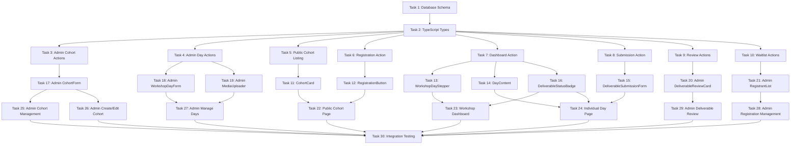

# Implementation Plan: Pilot Workshops

## Overview

This implementation plan delivers a structured 3-day workshop system with cohort-based enrollment, sequential day unlocking, deliverable submissions, and admin review workflows. The system implements a two-gate access model (registration + progress gates) with comprehensive RLS security.

## Tasks

- [x] 1. Database Schema and Migrations - Create database schema with tables for cohorts, workshop_days, workshop_day_media, workshop_registrations, workshop_progress, and workshop_deliverable_submissions. Include all constraints, indexes, and Row Level Security policies. **Requirements:** R1, R2, R4, R5, R6, R7, R8, R10, R15, R16
  - [x] 1.1. Create migration file for cohorts table with status enum, capacity, registration windows, and audit fields
  - [x] 1.2. Create migration file for workshop_days table with day_number constraint (1-3), deliverable_type enum, and unique constraint per cohort
  - [x] 1.3. Create migration file for workshop_day_media table with media_type enum and sort_order
  - [x] 1.4. Create migration file for workshop_registrations table with status enum and unique constraint
  - [x] 1.5. Create migration file for workshop_progress table with deliverable_status enum and review fields
  - [x] 1.6. Create migration file for workshop_deliverable_submissions table with submission type fields
  - [x] 1.7. Create RLS policies for cohorts (public read for 'open' status, admin full access)
  - [x] 1.8. Create RLS policies for workshop_days and workshop_day_media (public read when cohort open, admin write)
  - [x] 1.9. Create RLS policies for workshop_registrations (users own data, admin full access)
  - [x] 1.10. Create RLS policies for workshop_progress and workshop_deliverable_submissions (users own data, admin full access)

- [x] 2. TypeScript Type Definitions - Create comprehensive TypeScript interfaces for all database tables, server action parameters, and component props. **Requirements:** All
  - [x] 2.1. Create types file with Cohort, WorkshopDay, WorkshopDayMedia interfaces
  - [x] 2.2. Create WorkshopRegistration, WorkshopProgress, WorkshopDeliverableSubmission interfaces
  - [x] 2.3. Create derived types (DayWithProgress, SubmissionData) for UI layer
  - [x] 2.4. Create server action parameter and return types
  - [x] 2.5. Export all types from central location

- [x] 3. Core Server Actions - Cohort Management (Admin) - Implement server actions for admins to create, read, update cohorts with validation and audit trail. **Requirements:** R1, R12, R13, R20
  - [x] 3.1. Implement createCohort(data) server action with profile_id lookup and audit fields
  - [x] 3.2. Implement updateCohort(cohortId, data) server action with updated_by tracking
  - [x] 3.3. Implement getCohorts() server action with admin filtering (all statuses)
  - [x] 3.4. Implement getCohortById(cohortId) server action with registrations count
  - [x] 3.5. Implement updateCohortStatus(cohortId, status) server action with validation
  - [x] 3.6. Add error handling for RLS policy violations

- [x] 4. Core Server Actions - Workshop Day Content (Admin) - Implement server actions for admins to create and manage workshop day content and media attachments. **Requirements:** R2, R13, R15
  - [x] 4.1. Implement createWorkshopDay(cohortId, data) server action with day_number validation
  - [x] 4.2. Implement updateWorkshopDay(dayId, data) server action with updated_by tracking
  - [x] 4.3. Implement getWorkshopDays(cohortId) server action ordered by day_number
  - [x] 4.4. Implement uploadDayMedia(dayId, file, mediaType) server action with Supabase Storage integration
  - [x] 4.5. Implement addExternalMedia(dayId, url, mediaType, label) server action
  - [x] 4.6. Implement deleteDayMedia(mediaId) server action with cascade handling
  - [x] 4.7. Implement updateMediaSortOrder(dayId, mediaItems) server action

- [x] 5. Core Server Actions - Public Cohort Listing - Implement server action to fetch public cohorts with registration eligibility and user registration status. **Requirements:** R3, R20
  - [x] 5.1. Implement getPublicCohorts() server action filtering status='open'
  - [x] 5.2. Add registered_count aggregation using join with workshop_registrations
  - [x] 5.3. Add capacity remaining calculation
  - [x] 5.4. Add user registration status lookup if authenticated
  - [x] 5.5. Add registration window validation (opens_at, closes_at)
  - [x] 5.6. Sort by start_date ascending
  - [x] 5.7. Handle unauthenticated users gracefully

- [x] 6. Core Server Actions - Participant Registration - Implement server action for participants to register for cohorts with capacity and waitlist handling. **Requirements:** R4, R10, R14, R17
  - [x] 6.1. Implement registerForCohort(cohortId) server action with authentication check
  - [x] 6.2. Add cohort status validation (must be 'open')
  - [x] 6.3. Add registration window validation (opens_at, closes_at)
  - [x] 6.4. Implement capacity check and waitlist logic
  - [x] 6.5. Add duplicate registration error handling (unique constraint)
  - [x] 6.6. Return confirmation with cohort name, start_date, and registration status
  - [x] 6.7. Add comprehensive error messages per R17

- [x] 7. Core Server Actions - Workshop Dashboard and Day Unlock - Implement server action to fetch workshop dashboard with computed unlock states and lazy progress row creation. **Requirements:** R5, R8, R9, R11
  - [x] 7.1. Implement getWorkshopDashboard(cohortId) server action with registration verification
  - [x] 7.2. Add cohort start_date check for Day 1 unlock computation
  - [x] 7.3. Implement lazy creation of Day 1 progress row when unlocked
  - [x] 7.4. Implement isDayUnlockedForUser(dayId, profileId) helper function
  - [x] 7.5. Add sequential unlock logic (Day 2 depends on Day 1, Day 3 on Day 2)
  - [x] 7.6. Handle requires_admin_approval flag in unlock logic
  - [x] 7.7. Use left join for workshop_progress to handle missing rows
  - [x] 7.8. Return days with unlocked status, progress, unlock_message, and media
  - [x] 7.9. Support multi-cohort dashboard (show all registered cohorts)

- [x] 8. Core Server Actions - Deliverable Submission - Implement server action for participants to submit deliverables with file upload support and resubmission handling. **Requirements:** R6, R17, R18
  - [x] 8.1. Implement submitDeliverable(dayId, submissionData) server action
  - [x] 8.2. Add day unlock verification before submission
  - [x] 8.3. Implement file upload to Supabase Storage for file-based deliverables
  - [x] 8.4. Create workshop_deliverable_submission record
  - [x] 8.5. Update workshop_progress with deliverable_submitted_at and status='submitted'
  - [x] 8.6. Handle resubmission (create new submission record, update progress status back to 'submitted')
  - [x] 8.7. Support text, file, and video URL submission types
  - [x] 8.8. Return submission confirmation

- [x] 9. Core Server Actions - Admin Deliverable Review - Implement server actions for admins to review, approve, and reject deliverables with feedback. **Requirements:** R7, R19
  - [x] 9.1. Implement getSubmissionsForReview(cohortId?, status?) server action
  - [x] 9.2. Add filtering by cohort and deliverable_status
  - [x] 9.3. Join with profiles for participant names and workshop_days for day titles
  - [x] 9.4. Implement reviewDeliverable(progressId, status, reviewNote?) server action
  - [x] 9.5. Update workshop_progress with deliverable_status, reviewed_by, reviewed_at, review_note
  - [x] 9.6. Trigger next day unlock when status='approved' (via isDayUnlockedForUser)
  - [x] 9.7. Get latest submission per participant per day (ORDER BY submitted_at DESC LIMIT 1)
  - [x] 9.8. Display submission count for multiple submissions

- [x] 10. Core Server Actions - Waitlist Management - Implement admin server actions to manage waitlisted participants and change registration status. **Requirements:** R10
  - [x] 10.1. Implement getRegistrations(cohortId) server action with status filtering
  - [x] 10.2. Include participant profile data (name, email)
  - [x] 10.3. Display registered count vs capacity
  - [x] 10.4. Implement updateRegistrationStatus(registrationId, newStatus) server action
  - [x] 10.5. Validate status transitions (waitlisted → registered)
  - [x] 10.6. Trigger Day 1 unlock if cohort already started and new status is 'registered'
  - [x] 10.7. Return updated registration with confirmation

- [x] 11. UI Component - CohortCard - Create component to display cohort information on public listing page with dynamic registration status. **Requirements:** R3, R20
  - [x] 11.1. Create CohortCard component with CohortCardProps interface
  - [x] 11.2. Display name, description, start_date formatted
  - [x] 11.3. Show capacity remaining if capacity set
  - [x] 11.4. Conditionally render registration status (registered, waitlisted, opens on date, closed)
  - [x] 11.5. Render RegistrationButton with appropriate state
  - [x] 11.6. Add responsive styling with TailwindCSS
  - [x] 11.7. Handle loading and error states

- [x] 12. UI Component - RegistrationButton - Create button component that handles cohort registration with loading and confirmation states. **Requirements:** R3, R4, R14
  - [x] 12.1. Create RegistrationButton component with disabled states
  - [x] 12.2. Call registerForCohort server action on click
  - [x] 12.3. Show loading spinner during registration
  - [x] 12.4. Display success toast with confirmation message (cohort name, start date)
  - [x] 12.5. Display waitlist toast if waitlisted
  - [x] 12.6. Handle error messages from server action
  - [x] 12.7. Disable if already registered (show "You're registered" badge)
  - [x] 12.8. Disable if registration not open (show "Registration opens on [date]")

- [x] 13. UI Component - WorkshopDayStepper - Create visual stepper component showing Days 1-3 with progress states and unlock status. **Requirements:** R9
  - [x] 13.1. Create WorkshopDayStepper component with DayProgress array prop
  - [x] 13.2. Render horizontal or vertical stepper with connecting lines
  - [x] 13.3. Display day_number, title, and deliverable_status badge
  - [x] 13.4. Style unlocked days as clickable links (full color)
  - [x] 13.5. Style locked days as greyed out with unlock_message tooltip
  - [x] 13.6. Show checkmark icon for approved deliverables
  - [x] 13.7. Highlight current day or next available day
  - [x] 13.8. Add responsive design for mobile

- [ ] 14. UI Component - DayContent - Create component to render workshop day content body and media attachments. **Requirements:** R2, R9, R15
  - [x] 14.1. Create DayContent component accepting WorkshopDay prop
  - [x] 14.2. Render content_body as rich text (TipTap viewer or HTML)
  - [x] 14.3. Display workshop_day_media sorted by sort_order
  - [x] 14.4. Render PDFs with download link or preview
  - [x] 14.5. Render images with lightbox or full-width display
  - [x] 14.6. Render video_link with embedded player (YouTube, Vimeo)
  - [x] 14.7. Render external_link as styled anchor
  - [x] 14.8. Display optional label for each media item
  - [x] 14.9. Add styling for media grid layout

- [x] 15. UI Component - DeliverableSubmissionForm - Create form component for participants to submit deliverables with type-specific inputs. **Requirements:** R6, R17, R18
  - [x] 15.1. Create DeliverableSubmissionForm component with DeliverableSubmissionFormProps
  - [x] 15.2. Conditionally render based on deliverable_type (text, file, video, pending_confirmation)
  - [x] 15.3. Render textarea for text submissions
  - [x] 15.4. Render file input for file submissions with drag-and-drop
  - [x] 15.5. Render URL input for video submissions with validation
  - [x] 15.6. Call submitDeliverable server action on form submit
  - [x] 15.7. Show loading state during submission and file upload
  - [x] 15.8. Display existing submission if present
  - [x] 15.9. Show resubmit option if status='rejected' with review_note
  - [x] 15.10. Display success message after submission

- [x] 16. UI Component - DeliverableStatusBadge - Create visual badge component to display deliverable status with appropriate colors and icons. **Requirements:** R9
  - [x] 16.1. Create DeliverableStatusBadge component accepting deliverable_status prop
  - [x] 16.2. Style 'not_submitted' as grey with pending icon
  - [x] 16.3. Style 'submitted' as blue with clock icon
  - [x] 16.4. Style 'approved' as green with checkmark icon
  - [x] 16.5. Style 'rejected' as red with X icon
  - [x] 16.6. Add hover tooltip with status explanation
  - [x] 16.7. Use Lucide React icons

- [x] 17. UI Component - Admin CohortForm - Create form component for admins to create and edit cohorts. **Requirements:** R1, R12, R13, R20
  - [x] 17.1. Create CohortForm component with optional cohort prop (edit mode)
  - [x] 17.2. Add form fields: name, description (TipTap editor), start_date, capacity
  - [x] 17.3. Add optional fields: registration_opens_at, registration_closes_at
  - [x] 17.4. Add status dropdown (draft, open, closed, completed)
  - [x] 17.5. Call createCohort or updateCohort server action on submit
  - [x] 17.6. Add form validation (required fields, date validation)
  - [x] 17.7. Display created_by and updated_by info in edit mode
  - [x] 17.8. Show loading state during submission
  - [x] 17.9. Redirect to cohort list on success

- [x] 18. UI Component - Admin WorkshopDayForm - Create form component for admins to create and edit workshop day content. **Requirements:** R2, R13, R15
  - [x] 18.1. Create WorkshopDayForm component with optional dayId prop (edit mode)
  - [x] 18.2. Add form fields: day_number (1-3), title, content_body (TipTap editor), deliverable_instructions
  - [x] 18.3. Add deliverable_type dropdown (text, file, video, pending_confirmation)
  - [x] 18.4. Add requires_admin_approval checkbox
  - [x] 18.5. Render MediaUploader component for media attachments
  - [x] 18.6. Call createWorkshopDay or updateWorkshopDay server action
  - [x] 18.7. Add validation for unique day_number per cohort
  - [x] 18.8. Display created_by and updated_by info in edit mode
  - [x] 18.9. Show loading state during submission

- [x] 19. UI Component - Admin MediaUploader - Create component for admins to upload and manage workshop day media attachments. **Requirements:** R15
  - [x] 19.1. Create MediaUploader component accepting workshop_day_id prop
  - [x] 19.2. Add file upload input for PDFs and images
  - [x] 19.3. Add URL input fields for video_link and external_link
  - [x] 19.4. Add optional label field for each media item
  - [x] 19.5. Call uploadDayMedia or addExternalMedia server actions
  - [x] 19.6. Display existing media sorted by sort_order
  - [x] 19.7. Implement drag-and-drop reordering with updateMediaSortOrder
  - [x] 19.8. Add delete button per media item with confirmation
  - [x] 19.9. Show upload progress for files
  - [x] 19.10. Display thumbnails for images and icons for other types

- [x] 20. UI Component - Admin DeliverableReviewCard - Create component for admins to review and approve/reject deliverable submissions. **Requirements:** R7, R19
  - [x] 20.1. Create DeliverableReviewCard component with DeliverableReviewCardProps
  - [x] 20.2. Display participant name, day title, submitted_at timestamp
  - [x] 20.3. Render submission_text inline with scroll for long text
  - [x] 20.4. Render file_storage_path as download link or preview
  - [x] 20.5. Render external_video_url with embedded player
  - [x] 20.6. Add "Approve" button calling reviewDeliverable with status='approved'
  - [x] 20.7. Add "Reject" button opening modal for review_note entry
  - [x] 20.8. Call reviewDeliverable server action with note
  - [x] 20.9. Display current status badge if already reviewed
  - [x] 20.10. Show submission count if multiple submissions exist
  - [x] 20.11. Disable buttons if already reviewed

- [x] 21. UI Component - Admin RegistrantList - Create component displaying all registrants for a cohort with waitlist management actions. **Requirements:** R10, R13
  - [x] 21.1. Create RegistrantList component accepting cohortId prop
  - [x] 21.2. Call getRegistrations server action to fetch data
  - [x] 21.3. Display table with columns: name, email, registered_at, status
  - [x] 21.4. Show registered count and capacity in header
  - [x] 21.5. Add status filter (all, registered, waitlisted, cancelled)
  - [x] 21.6. Add "Change to Registered" action button for waitlisted participants
  - [x] 21.7. Call updateRegistrationStatus server action on action
  - [x] 21.8. Show confirmation modal before status change
  - [x] 21.9. Add search/filter functionality
  - [x] 21.10. Paginate if large number of registrants

- [x] 22. Page - Public Cohort Listing (/hub/pilot-workshops) - Create public-facing page displaying all open cohorts with registration capability. **Requirements:** R3, R20
  - [x] 22.1. Create app/hub/pilot-workshops/page.tsx
  - [x] 22.2. Call getPublicCohorts server action
  - [x] 22.3. Render CohortCard for each cohort
  - [x] 22.4. Add page title and description
  - [x] 22.5. Show empty state if no open cohorts
  - [x] 22.6. Add loading skeleton during fetch
  - [x] 22.7. Make page responsive
  - [x] 22.8. Add navigation link in main hub menu

- [x] 23. Page - Workshop Dashboard (/hub/pilot-workshops/[cohortId]) - Create participant-facing dashboard showing workshop days with progress and unlock status. **Requirements:** R5, R9, R11, R14
  - [x] 23.1. Create app/hub/pilot-workshops/[cohortId]/page.tsx
  - [x] 23.2. Call getWorkshopDashboard server action
  - [x] 23.3. Display cohort name and start_date
  - [x] 23.4. Render WorkshopDayStepper with days array
  - [x] 23.5. Display registration confirmation if newly registered
  - [x] 23.6. Show "Starts on [date]" if cohort not yet started
  - [x] 23.7. Handle loading and error states (not registered, etc.)
  - [x] 23.8. Add breadcrumb navigation
  - [x] 23.9. Support multiple cohorts (add cohort selector if user registered for multiple)

- [x] 24. Page - Individual Workshop Day (/hub/pilot-workshops/[cohortId]/day/[dayNumber]) - Create page displaying single workshop day content with deliverable submission form. **Requirements:** R6, R9, R15, R17, R18
  - [x] 24.1. Create app/hub/pilot-workshops/[cohortId]/day/[dayNumber]/page.tsx
  - [x] 24.2. Fetch workshop day with progress and media
  - [x] 24.3. Render DayContent component
  - [x] 24.4. Render DeliverableSubmissionForm if day is unlocked
  - [x] 24.5. Show locked message if day not unlocked
  - [x] 24.6. Display DeliverableStatusBadge with current status
  - [x] 24.7. Show review_note if deliverable rejected
  - [x] 24.8. Add navigation to previous/next day (if unlocked)
  - [x] 24.9. Add breadcrumb navigation back to dashboard
  - [x] 24.10. Handle edge cases (day doesn't exist, not registered)

- [x] 25. Page - Admin Cohort Management (/admin/pilot-workshops) - Create admin page listing all cohorts with create and manage actions. **Requirements:** R1, R12
  - [x] 25.1. Create app/admin/pilot-workshops/page.tsx
  - [x] 25.2. Call getCohorts server action (shows all statuses for admin)
  - [x] 25.3. Display table with columns: name, start_date, status, capacity, registered_count
  - [x] 25.4. Add "Create Cohort" button linking to create page
  - [x] 25.5. Add action buttons per cohort: Edit, View Registrations, Review Deliverables
  - [x] 25.6. Add status filter (all, draft, open, closed, completed)
  - [x] 25.7. Add search functionality
  - [x] 25.8. Show created_by and updated_by info
  - [x] 25.9. Restrict access to admin/super_admin roles

- [ ] 26. Page - Admin Create/Edit Cohort (/admin/pilot-workshops/create, /admin/pilot-workshops/[cohortId]/edit) - Create admin pages for creating new cohorts and editing existing ones. **Requirements:** R1, R12, R13, R20
  - [ ] 26.1. Create app/admin/pilot-workshops/create/page.tsx
  - [ ] 26.2. Create app/admin/pilot-workshops/[cohortId]/edit/page.tsx
  - [ ] 26.3. Render CohortForm component in both pages
  - [ ] 26.4. Fetch existing cohort data for edit page
  - [ ] 26.5. Add "Manage Workshop Days" section in edit page
  - [ ] 26.6. Display list of existing workshop days with edit/create links
  - [ ] 26.7. Add breadcrumb navigation
  - [ ] 26.8. Restrict access to admin/super_admin roles

- [ ] 27. Page - Admin Manage Workshop Days (/admin/pilot-workshops/[cohortId]/days/create, /admin/pilot-workshops/[cohortId]/days/[dayId]/edit) - Create admin pages for creating and editing workshop day content. **Requirements:** R2, R13, R15
  - [ ] 27.1. Create app/admin/pilot-workshops/[cohortId]/days/create/page.tsx
  - [ ] 27.2. Create app/admin/pilot-workshops/[cohortId]/days/[dayId]/edit/page.tsx
  - [ ] 27.3. Render WorkshopDayForm component in both pages
  - [ ] 27.4. Fetch existing day data for edit page
  - [ ] 27.5. Add breadcrumb navigation back to cohort edit
  - [ ] 27.6. Restrict access to admin/super_admin roles

- [ ] 28. Page - Admin Registration Management (/admin/pilot-workshops/[cohortId]/registrations) - Create admin page to view and manage cohort registrations and waitlist. **Requirements:** R10, R13
  - [ ] 28.1. Create app/admin/pilot-workshops/[cohortId]/registrations/page.tsx
  - [ ] 28.2. Render RegistrantList component
  - [ ] 28.3. Display cohort name and capacity in header
  - [ ] 28.4. Add export functionality (CSV download)
  - [ ] 28.5. Add breadcrumb navigation back to admin cohort list
  - [ ] 28.6. Restrict access to admin/super_admin roles

- [ ] 29. Page - Admin Deliverable Review (/admin/pilot-workshops/[cohortId]/reviews) - Create admin page to review submitted deliverables with filtering and bulk actions. **Requirements:** R7, R19
  - [ ] 29.1. Create app/admin/pilot-workshops/[cohortId]/reviews/page.tsx
  - [ ] 29.2. Call getSubmissionsForReview server action
  - [ ] 29.3. Render DeliverableReviewCard for each submission
  - [ ] 29.4. Add filters: day_number, deliverable_status
  - [ ] 29.5. Group submissions by day_number
  - [ ] 29.6. Show count of pending reviews in header
  - [ ] 29.7. Add breadcrumb navigation
  - [ ] 29.8. Restrict access to admin/super_admin roles
  - [ ] 29.9. Auto-refresh or show notification when new submissions arrive

- [ ] 30. Integration Testing and Edge Case Handling - Test end-to-end flows and handle edge cases with proper error messages. **Requirements:** R17
  - [ ] 30.1. Test registration flow with capacity limits and waitlist
  - [ ] 30.2. Test Day 1 auto-unlock on cohort start_date
  - [ ] 30.3. Test sequential day unlock with admin approval
  - [ ] 30.4. Test deliverable submission and resubmission after rejection
  - [ ] 30.5. Test admin review workflow with approve/reject
  - [ ] 30.6. Test multi-cohort participant access
  - [ ] 30.7. Test RLS policies (ensure users can't access other users' data)
  - [ ] 30.8. Test duplicate registration prevention
  - [ ] 30.9. Test cohort lifecycle state transitions
  - [ ] 30.10. Verify all error messages match R17 requirements
  - [ ] 30.11. Test with missing progress rows (should not error)
  - [ ] 30.12. Test file upload to Supabase Storage
  - [ ] 30.13. Test registration window validation (opens_at, closes_at)

## Notes

- All database migrations should be tested in development environment before applying to production
- Server actions must include proper error handling and logging
- Components should follow existing project patterns and styling conventions
- RLS policies are critical for security - test thoroughly with different user roles
- File uploads to Supabase Storage require proper bucket configuration
- TipTap editor integration should reuse existing editor components if available

## Task Dependency Graph

